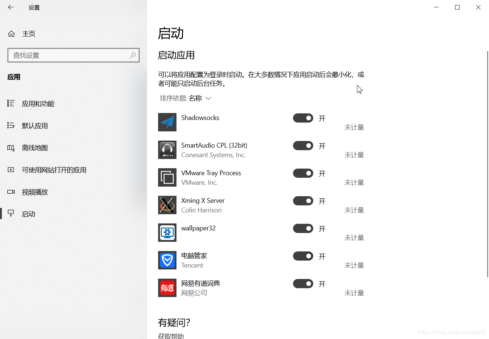
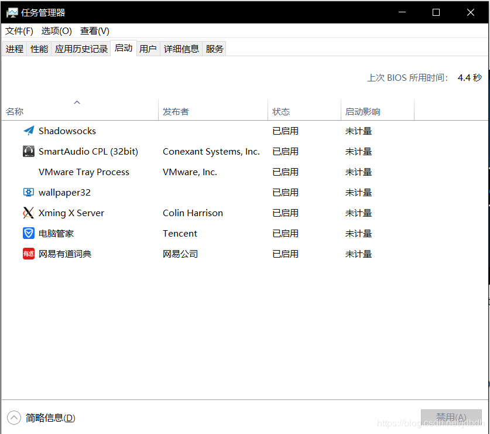
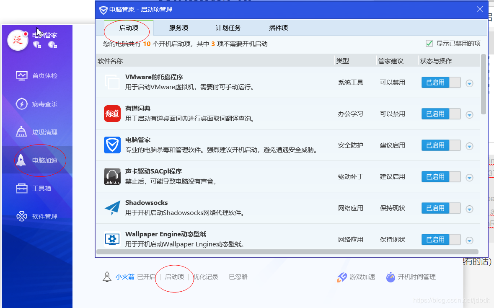
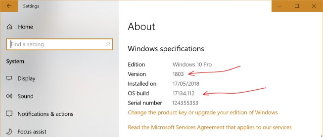
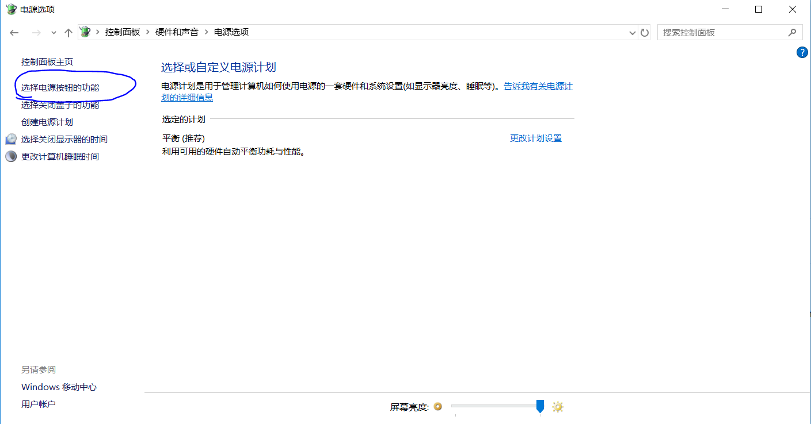
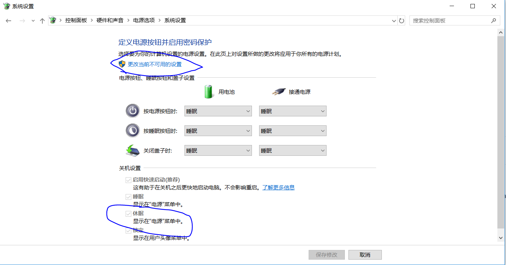
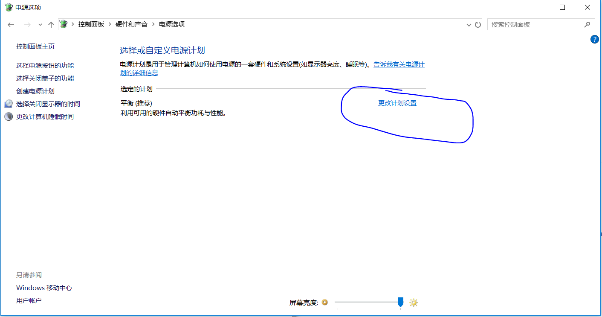
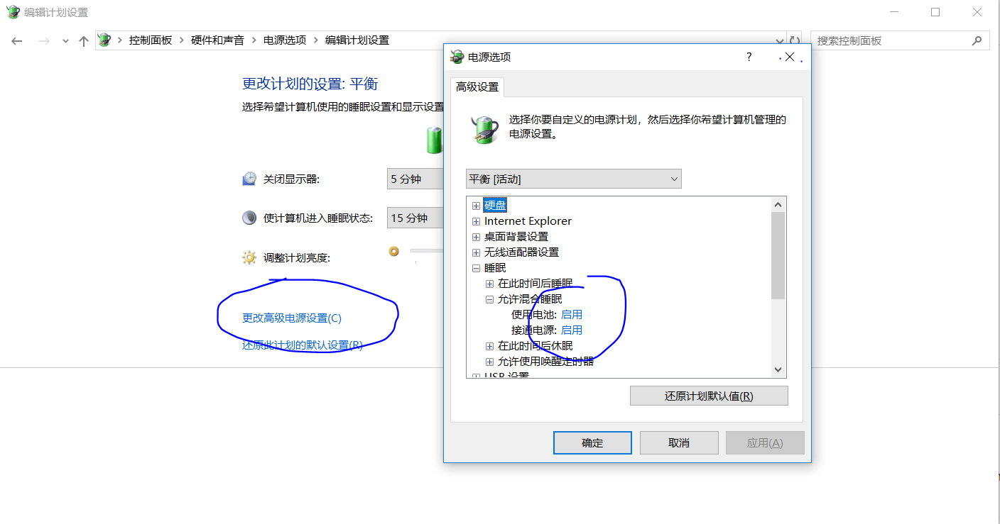
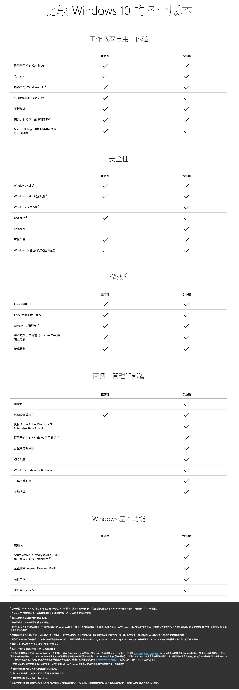
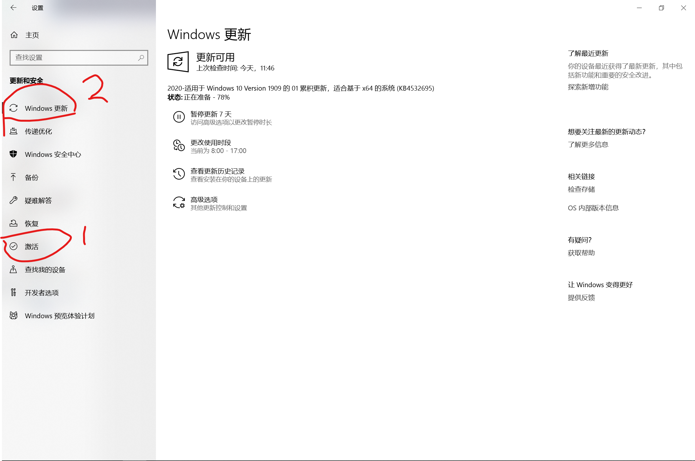

# 一 PowerShell

Win10中有两种Shell：PowerShell和Cmd。

* Cmd功能有限
* PowerShell功能强大, 且有很多命令与Linux Bash命令相似，推荐使用.

## 常用命令

* `ls`：显示目录或文件

* `pwd`：显示当前目录

* `explorer .`：于当前目录打开文件浏览器

* `cd`：改变工作目录

  > `cd ~`：回到用户目录

* 获取帮助

  * `man`、`help`命令或`-h`、`--help`、`/?`选项
  * Powershell保证`-?`必定获取到*cmdlets*的帮助

  > 其实没啥子用

* `cat`：输出文件内容

* `notepad filename`:用记事本打开文本

* 支持重定向，可用于ssh中传输文件，暂不熟

* `clear`：清空屏幕

* `echo $Env:PATH`：打印环境变量, 如`PATH`

  > 与cmd不同，cmd中通过`%PATH%`可以获取值

  > 关于更多环境变量和变量的知识, 见1.2小节-Script

* `where.exe <Command>` 查找名字所在目录

* ...

>其余命令可参考：
>[Table of Basic PowerShell Commands](https://blogs.technet.microsoft.com/heyscriptingguy/2015/06/11/table-of-basic-powershell-commands/)

## 相关概念

* 大部分Shell命令的处理对象是字符串, 而PowerShell命令的处理对象是一个包含结构化信息的对象
* PowerShell中的原生命令被称为*cmdlets*, 使用者也可提供自己的*cmdlets*
*  PowerShell基于.Net平台, 支持C#部分语法的使用
* 命令和变量大小写不敏感

## 语法

### 命令名

PowerShell的命令拥有自己的一套命令规则, 同时也提供了匿名, 帮助习惯Bash Shell的人使用.

略, 以后补充

### 变量

* 命名: 变量名包含`_`和任意数字和字符, 使用时必须以前缀`$`标识

* 创建或赋值

  ```powershell
  PS> $loc # 创建变量
  PS> $loc = Get-Location # 创建变量的同时赋值
  PS> $loc # 打印变量
  
  Path
  ----
  C:\temp
  ```

  > 可以看出, 声明变量时, 如果变量不存在则创建; 如果变量存在, 则打印.

### 使用环境变量

* 打印所有环境变量

  ```powershell
  Get-ChildItem env:
  ```

* 打印某个环境变量

  ```powershell
  PS> $env:SystemRoot
  C:\WINDOWS
  ```

* 修改环境变量

  ```powershell
  $env:LIB_PATH='/usr/local/lib'
  ```

### 字符串

* 单引号

  不解析字符串中的变量

* 双引号

  解析字符串中的变量, 如

  ```powershell
  PS C:\Users\Sidian.Luo\Desktop> $a="$pwd/b"
  PS C:\Users\Sidian.Luo\Desktop> $a
  C:\Users\Sidian.Luo\Desktop/b
  ```

### 注释

以`#`为前缀的字符串

### 管道

以`|`连接多个命令, 每个命令的输出将作为下一个命令的输入. 

> 与其他Shell的管道不同, PowerShell的管道传输的是对象

## 特殊变量

下面列出部分特殊变量

* `$HOME` 用户家目录
* `$PWD` 当前工作目录
* `$PSScriptRoot` 执行脚本时, 脚本的根目录
* ...

> 详细参考[Powershell - Special Variables](https://www.tutorialspoint.com/powershell/powershell_special_variables.htm)

## 脚本

脚本文件以`.ps1`为后缀.

运行脚本

* 在PowerShell中

  ```powershell
  ./script.ps1
  ```

* 在CMD中

  ```cmd
  powershell ./script.ps1
  ```

> 即必须以路径的形式执行脚本

这里有几个坑...

* 凡是由系统调用的脚本, 只认Batch脚本. PowerShell脚本在启动项和计划任务中, 都不会被执行.

* 必须以管理员身份打开PowerShell来提升权限, 如

  ```powershell
  Set-ExecutionPolicy -ExecutionPolicy Bypass -Scope Process
  ```

  > 提升权限后应该一直有效了吧?

## 参考

* [PowerShell Scripting](https://docs.microsoft.com/en-us/powershell/scripting/how-to-use-docs?view=powershell-6) 官方文档
* [PowerShell tutorialspoint.com](https://www.tutorialspoint.com/powershell/index.htm)

# 二 Batch Script

> batch脚本用的不多了, 下面简单记录

## 介绍

* Batch脚本扩展名`.bat`或`.cmd`, 由`cmd.exe`执行

* 命令大小写不敏感

* 运行
  * GUI中, 点击即可
  * CLI中, 输入文件地址即可
  * 在WSL中, `cmd.exe /c foo.bat`
  
  > 其他方式略; Window对其支持度很高

## 常用命令

> 已经不常用了, 详细见[Batch Script - Commands](https://www.tutorialspoint.com/batch_script/batch_script_commands.htm)

* `rem` & `echo`

  * `rem` 后接注释; `echo`用于输出信息, 和控制命令回显模式
  * `echo on` 打开回显模式
    * 脚本中执行的命令将被回显到CMD中
    * `rem`命令也是

  * `echo off` 关闭回显模式
    * 脚本中执行的命令不被回显到CMD中
    * `rem`命令也是

  > `@echo`和`echo`没啥区别; `rem`就是个没啥用的命令, 所以作为注释.
  
* 查找

  `where.exe <Command>` 查找名字所在目录

* 帮助

  ```
  command /?
  ```
  
* 常用环境变量

  * `userprofile` 用户家目录
  * `windir` Windows家目录, 如`C:\WINDOWS`


## 语法

* `>` 重定向上一条命令的输出到下一条命令的输入.

* 变量

  * 设置变量

    ```cmd
    set a=hello
    ```

  * 获取变量

    变量名以`%`围绕

    ```cmd
    echo %a%
    ```

  * 连接变量

    ```cmd
    set b=%a% world
    echo %b%
    ```
  
* 字符串

  无变量替换功能

## 其他

### 无窗口运行bat

通过vb脚本运行bat, 如

`Cmder.vbs`

```vbscript
WScript.CreateObject( "WScript.Shell" ).run "cmd /c Cmder.bat", 0
```

## 参考

* [Batch Script Tutorial](https://www.tutorialspoint.com/batch_script/index.htm)

# 命令

## 查看端口占用

* 通过端口找打进程号

  ```shell
  netstat -aon|findstr "8081"
  ```

* 查看进程详细信息

  ```shell
  tasklist|findstr "9088"
  ```

* 杀死进程

  ```shell
  taskkill /T /F /PID 9088 
  ```

# 三 管理

## 自启

### 添加

思路：将程序的快捷方式添加到用户的自启目录中。

1. 按`win+R`，输入`shell:startup`，直接进入对应文件夹
2. 将要自启的程序的快捷键添加进去

然后可以用上面三种方法看到自己已经添加成功了。

### 自启管理

有三种方法：

1. 按`win`键--->设置--->应用--->启动
   
2. 打开任务管理器--->启动
   
3. 打开电脑管家（如果有的话）--->电脑加速--->启动项
   

> 参考[Change which apps run automatically at startup in Windows 10](https://support.microsoft.com/en-us/help/4026268/windows-10-change-startup-apps)

## 计划任务

Win->计算机管理->计划任务

## 注册表

可看作Windows的数据库, 因此对直接修改注册表不友好, 且危险

* 打开注册表

  `Win+R` --> 输入`regedit`

## 组策略

组策略通过修改注册表实现, 相比直接修改注册表而言, 更为直观, 简易, 直接面向系统管理员.

* 集中式组策略 (Centralized Group Policy)
* 本地组策略 (Local Group Policy)

> 参考[What Is “Group Policy” in Windows?](https://www.howtogeek.com/125171/htg-explains-what-group-policy-is-and-how-you-can-use-it/)

## 域

* [什么是windows的域（Domain）？](https://www.jianshu.com/p/cc8d4bc9d25a)
* [域帐户的好处](https://wenku.baidu.com/view/169fc7a9d1f34693daef3e71.html)

# 四 配置

## 个性化

* 去除系统桌面图标(垃圾箱): `个性化->主题->相关的设置->桌面图标设置`

## 虚拟内存

* 查看虚拟内存大小: CLI中输入`systeminfo`
* 修改大小: `控制面板\系统和安全\系统\高级系统设置`, 然后自己找

## 手动更新

1. 按`Win`, 输入`update`, 找到OS版本, 及设备信息

   

   

2. 在[Windows 10 Update History](https://support.microsoft.com/en-us/help/4099479) 中找到对应更新, 获取更新号, 如KB4525241

   > 里面的1709,1803,1909都是Windows的不同版本, 类似Linux不同的发行版, 只能更新到版本最新, 不能从1709更新到1803, 除非使用其他方式.

3. 在 [Microsoft Update Catalog](http://www.catalog.update.microsoft.com/Home.aspx) 输入更新号, 找到对应版本下载

4. 下载后, 点击安装

> 参考[How To Download Windows 10 Updates Manually (And Install)](https://www.thetechmentor.com/posts/how-download-windows-10-updates-manually-and-install/)

## 安装Store

> 最新更新:
>
> 推荐使用[LTSB-Add-MicrosoftStore](https://github.com/kkkgo/LTSB-Add-MicrosoftStore)的方案, 下面的方案不太方便.

环境:

* 无本地安装包 *Microsoft.WindowsStore* , 即`Get-AppxPackage`命令找不到包

解决方案:

安装VirtualBox虚拟机, 下载Window10镜像, 创建虚拟机.

> 或使用[Vmware](https://www.7down.com/soft/310739.html)

1. 将虚拟机中` C:\Program Files\WindowsApps `中的以下文件拷贝到物理机对应目录中

   - Microsoft.VCLibs.140.00_14.0.22810.0_x64__8wekyb3d8bbwe
   - *Microsoft.VCLibs.140.00_14.0.22810.0_x86__8wekyb3d8bbwe*
   - Microsoft.NET.Native.Runtime.1.0_1.0.22929.0_x64__8wekyb3d8bbwe
   - *Microsoft.NET.Native.Runtime.1.0_1.0.22929.0_x86__8wekyb3d8bbwe*
   - Microsoft.WindowsStore_2015.7.1.0_x64__8wekyb3d8bbwe
   - *Microsoft.WindowsStore_2015.701.14.0_neutral_~_8wekyb3d8bbwe*

2. 打开Powershell, 重新注册该安装包, 如

   ```powershell
   Add-AppxPackage -DisableDevelopmentMode -Register "C:\Program Files\WindowsApps\Microsoft.WindowsStore_2015.7.1.0_x64__8wekyb3d8bbwe\AppxManifest.xml
   ```

3. 安装完毕, 按`Win`可搜索到商店

> 参考[Restore Microsoft Store application in Windows 10](https://superuser.com/questions/949112/restore-microsoft-store-application-in-windows-10)

## 设置混合睡眠模式

关于待机,休眠和休眠的区别, 见[零碎知识]

首先开启睡眠





然后开启混合睡眠模式





## 不息屏

* 常用方式

  设置 --> 系统 --> 电源和睡眠 . 然后设置屏幕和睡眠时间.

* 关闭屏保

  屏保会导致息屏, 关闭就好. 

  如果公司的域策略阻止了此行为, 需要修改注册表

  * 展开目录

    `HKEY_CURRENT_USER\Software\Policies\Microsoft\Windows\Control Panel\Desktop`

  * 修改`ScreenSaveActive`为0, 默认1

# 五 快捷键

## 系统

* 打开文件管理器：win+E

* 打开功能面板：win+x

* 关机：win+x -->U -->U

* 打开任务管理器：win+x -->T 或者 ctrl+shift+esc

* 切换应用：alt+tab

* 回到桌面：win+D

* 窗口大小调整：win+方向键

* 窗口方向：win+ctrl+方向键

* 切换应用：alt+tab（反方向加shift）

* 打开任务栏上某个应用：win+数字

* 关闭当前程序：alt+F4

* **锁屏**: `Win`+`L`

* 打开设备连接: `Win+K`

* 打开Windows Ink工作区: `Win+W`

* **截图**: `Win+Shift+S`

  > 默认保存到剪贴板

* **录屏**: `Win+G`

* **符号输入**: 微软拼音下, 输入`u`就会用了

## 程序通用

* 应用内切换标签：ctrl+tab
* 关闭当前标签：ctrl+W
* 关闭所有标签：ctrl+shift+W
* 打开新标签：ctrl+N
* 恢复标签：ctrl+shift+T
* 保存：ctrl+S
* 全部保存：ctrl+shift+S
* 切换标签：ctrl+tab（反方向加shift）
* 复制：ctrl+C
* 粘贴：ctrl+V
* 连续选择：ctrl+左键
* 范围选择：shift+左键
* 撤销（undo）：ctrl+Z
* **重做（redo）**：ctrl+Y

## 文件管理器

* 新建目录：ctrl+shift+N
* 选择一个文件：鼠标左键
* 范围选择：shift+鼠标左键
* 连续选择：ctrl+鼠标左键
* 前进（后退）：alt+左（右）方向键
* 当前目录打开Shell：shift+右键，然后会出现选项

## 浏览器

* 打开新标签页：ctrl+T
* 关闭标签页：ctrl+W
* **打开被关闭的标签页**：ctrl+shif+T
* 查看下一个标签页：ctrl+tab
* 转到指定标签：ctrl+数字
* 在新标签页中打开超链接：ctrl+点击链接
* 在新窗口中打开超链接：shift+点击链接
* **光标置于搜索栏**：ctrl+L
* 选择一段文字后微调选择范围：ctrl+方向键
* 重新加载：ctrl+R
* 重新加载并且清空缓存：ctrl+shift+R或ctrl+F5
* 内容搜索：ctr+F
* 保存网页：ctrl+D
* 打开新窗口：ctrl+N
* 关闭窗口：ctrl+shift+W
* 后退：backspace（貌似对chrome无效）
* 后退：alt+左方向键（都有效）
* 前进：shift+backspace（貌似对chrome无效）
* 前进：alt+右方向键（都有效）
* 打开首页：alt+home
* **在新窗口中打开链接**: `Ctrl`+鼠标左键

# 其他

## 家庭版vs.专业版

初次之外, 还有企业版, 教育版

### 区别



> 参考
>
> win10专业版和家庭版有什么区别？ - 小马的回答 - 知乎 https://www.zhihu.com/question/51633999/answer/306860365

### 升级

家庭版升级到专业版, 仅需输入专业版的产品密钥即可, 它会自动升级的; 然后更新下



## Scoop

* 介绍

  * Windows上的命令行程序安装器. 
  * Scoop的所有数据都存在`$HOME/scoop/`目录下
  * `$HOME/scoop/`目录结构
    * `apps/` 存安装的命令, 每个命令版本不同, 分别存于不同目录, 符号链接`current`指向当前使用版本命令的家目录
    * `buckets/` 存在所有仓库的信息, 默认有`main`仓库
    * `cache/` 缓存数据
    * `shims/` 该目录位于PATH路径下, 并且提供了运行对应命令的脚本, 运行`apps/`目录下当前使用的命令.

* 安装

  * 运行PowerShell.

    因为Scoop是通过Powershell脚本安装的

  * 提升权限, 允许运行远程脚本

    ```shell
    Set-ExecutionPolicy RemoteSigned -scope CurrentUser
    ```

  * 远程下载脚本并执行安装

    ```shell
    Invoke-Expression (New-Object System.Net.WebClient).DownloadString('https://get.scoop.sh')
    ```

    > `https://get.scoop.sh`会重定向一个具体的脚本地址上, 然后执行.
    >
    > 若安装失败, 先删除`$HOME/scoop`目录, 并将该地址替换为重定向的地址. 地址可在浏览器中打开, 能够看到重定向后的地址.

* 命令详解

  ```shell
  λ scoop
  Usage: scoop <command> [<args>]
  
  Some useful commands are:
  
  alias       Manage scoop aliases
  bucket      Manage Scoop buckets
  cache       Show or clear the download cache
  checkup     Check for potential problems
  cleanup     Cleanup apps by removing old versions
  config      Get or set configuration values
  create      Create a custom app manifest
  depends     List dependencies for an app
  export      Exports (an importable) list of installed apps
  help        Show help for a command
  hold        Hold an app to disable updates
  home        Opens the app homepage
  info        Display information about an app
  install     Install apps
  list        List installed apps
  prefix      Returns the path to the specified app
  reset       Reset an app to resolve conflicts
  search      Search available apps
  status      Show status and check for new app versions
  unhold      Unhold an app to enable updates
  uninstall   Uninstall an app
  update      Update apps, or Scoop itself
  virustotal  Look for app's hash on virustotal.com
  which       Locate a shim/executable (similar to 'which' on Linux)
  
  Type 'scoop help <command>' to get help for a specific command.
  ```

* 卸载Scoop

  与卸载其他命令一样的卸载Scoop

  ```shell
  scoop uninstall scoop
  ```

* 仓库

  Scoop自带`main`参数, 但软件较少, 可添加其他仓库, 如

  ```shell
  # 官方维护的仓库
  scoop bucket add extras
  # 第三方维护的仓库
  scoop bucket add scoopbucket https://github.com/yuanying1199/scoopbucket
  ```

> 参考[scoop——强大的Windows命令行包管理工具]()

