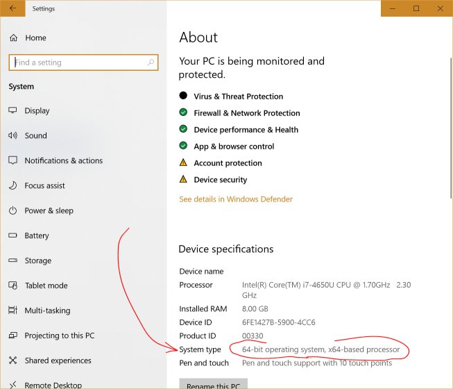

# 配置

## 个性化

* 去除系统桌面图标(垃圾箱): `个性化->主题->相关的设置->桌面图标设置`

## 虚拟内存

* 查看虚拟内存大小: CLI中输入`systeminfo`
* 修改大小: `控制面板\系统和安全\系统\高级系统设置`, 然后自己找

# 手动更新

1. 按`Win`, 输入`update`, 找到OS版本, 及设备信息

   

   

2. 在[Windows 10 Update History](https://support.microsoft.com/en-us/help/4099479) 中找到对应更新, 获取更新号, 如KB4525241

   > 里面的1709,1803,1909都是Windows的不同版本, 类似Linux不同的发行版, 只能更新到版本最新, 不能从1709更新到1803, 除非使用其他方式.

3. 在 [Microsoft Update Catalog](http://www.catalog.update.microsoft.com/Home.aspx) 输入更新号, 找到对应版本下载

4. 下载后, 点击安装

> 参考[How To Download Windows 10 Updates Manually (And Install)](https://www.thetechmentor.com/posts/how-download-windows-10-updates-manually-and-install/)

# 安装Store

环境:

* 无本地安装包 *Microsoft.WindowsStore* , 即`Get-AppxPackage`命令找不到包

解决方案:

安装VirtualBox虚拟机, 下载Window10镜像, 创建虚拟机.

> 或使用[Vmware](https://www.7down.com/soft/310739.html)

1. 将虚拟机中` C:\Program Files\WindowsApps `中的以下文件拷贝到物理机对应目录中

   - Microsoft.VCLibs.140.00_14.0.22810.0_x64__8wekyb3d8bbwe
   - *Microsoft.VCLibs.140.00_14.0.22810.0_x86__8wekyb3d8bbwe*
   - Microsoft.NET.Native.Runtime.1.0_1.0.22929.0_x64__8wekyb3d8bbwe
   - *Microsoft.NET.Native.Runtime.1.0_1.0.22929.0_x86__8wekyb3d8bbwe*
   - Microsoft.WindowsStore_2015.7.1.0_x64__8wekyb3d8bbwe
   - *Microsoft.WindowsStore_2015.701.14.0_neutral_~_8wekyb3d8bbwe*

2. 打开Powershell, 重新注册该安装包, 如

   ```powershell
   Add-AppxPackage -DisableDevelopmentMode -Register "C:\Program Files\WindowsApps\Microsoft.WindowsStore_2015.7.1.0_x64__8wekyb3d8bbwe\AppxManifest.xml
   ```

3. 安装完毕, 按`Win`可搜索到商店

> 参考[Restore Microsoft Store application in Windows 10](https://superuser.com/questions/949112/restore-microsoft-store-application-in-windows-10)

