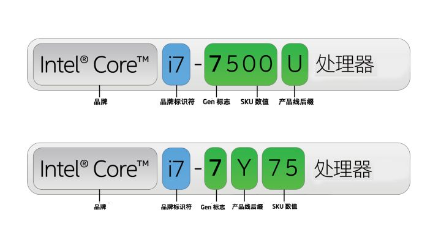
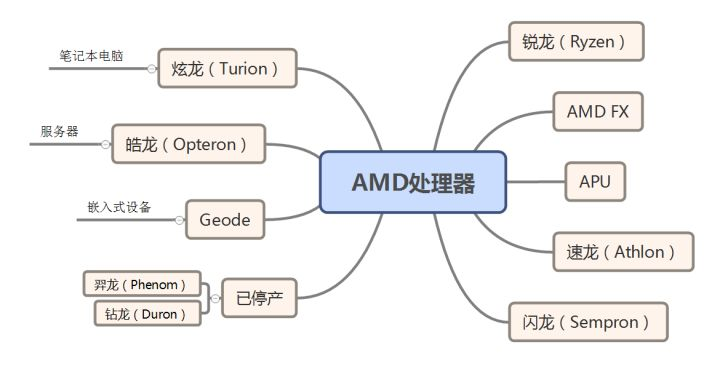
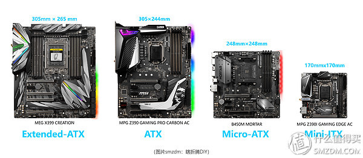
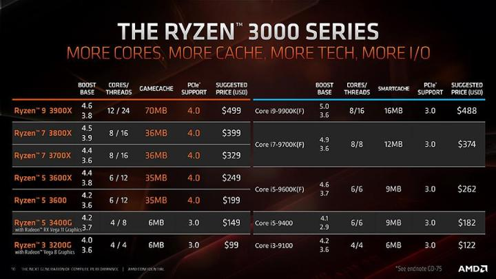
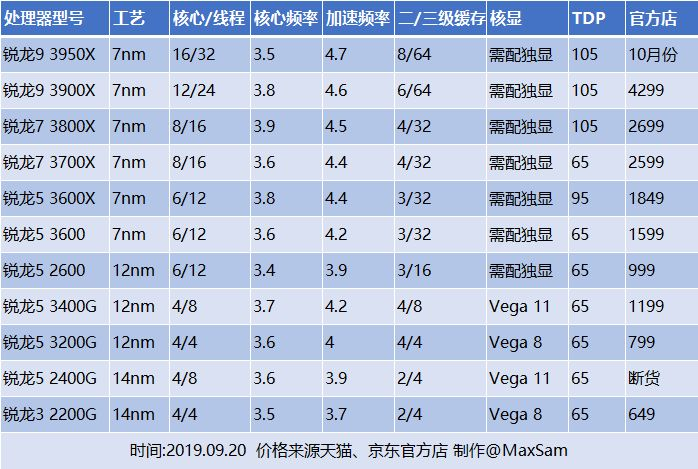

# CPU

## 分类

### Intel

#### 处理器系列

* 台式和笔记本电脑

  * 酷睿 Core
  * 奔腾 Pentium
  * 赛扬 Celeron

  > 同代产品中, 性能: 酷睿 > 奔腾 > 赛扬

* 服务器

  * 至强 Xeon
  * 安腾 Itanium

* 智能手机, 平板电脑和低成本PC

  * 凌动 Atom

* 可穿戴设备

  * Quark SoC

目前个人电脑中, 酷睿系列处理器很常见. 酷睿常见品牌处理器有 i3, i5, i7, 面向不同的用户, 同代酷睿系列中, 性能: i7 > i5 > i3.

> 并不是 i7 就一定比 i3强, i3高代CPU要比 i7低代CPU强. 

#### 处理器编号

后缀表示CPU不同的特点

* 台式机
  * K 不锁频, 即可用于超频
  * T 功耗优化过的
* 移动式
  * H 集显是高性能的
  * HK 集显是高性能的, 且CPU未锁频
  * KQ 集显是高性能的, 且CPU四核
  * Y 极低功耗
  * U 超低功耗

> 参考
>
> * [About Intel® Processor Numbers]https://www.intel.com/content/www/us/en/processors/processor-numbers.html)
> * [怎么让小白理解intel处理器（CPU）的分类？](https://www.zhihu.com/question/32669957/answer/158384001)

### AMD

#### 处理器系列

> 性能: 锐龙 > AMD FX > APU > 速龙 > 闪龙

锐龙Ryzen3,5,7分别对标Intel的Core i3,i5,i7, 是面同不同用户的产品.

#### 处理器编号

与Intel类型, 编号首字母表示年代, 后缀字母表示特性

* K 可超频
* X 超频强化
* E 节能版
* B 低功耗
* M 移动版

## 排行榜

* [CPU性能排行](https://cpu.51240.com/)
* [CPU天梯图](http://www.mydrivers.com/zhuanti/tianti/cpu/)

## 其他

### 介绍

* 一个超线程的核相当于两个核，但是性能肯定比不上两个核。
* intel cpu系列：i3、i5、i7、E5。其中，型号后有k的表示可以超频

### 频率

* 主频：正常工作频率

* 睿频：根据工作情况可自动上涨的频率

* 超频：人为提升的频率，是CPU过载运行, 对CPU伤害大，很多cpu不支持超频

  > 貌似Intel CPU后面有K的可以超载.

  ----------

* 主频=外频*倍频

* FSB前端总线不等于外频

> 主频低, 也意味着低功耗吧? 

### CPU架构

cpu有很多架构，这三种很常见：**ARM** 、**x86**(IA-32、i386)、 **x86_64**(x64、AMD64、intel64)

架构是一个很抽象的概念，不同cpu产商可以生产同一架构的cpu。操作系统通常有对应不同cpu架构的版本。

x86包括i386、i686等处理器，支持32位地址空间。x64支持64位地址空间。

arm采用精简集指令，x86_64和x86采用复杂集指令。

树莓派是arm架构的。arm架构有很多版本，ARMv3道ARMv7支持32位地址空间，ARMv8-A架构支持64位。

> 参考：
>
> * https://en.wikipedia.org/wiki/ARM_architecture https://en.wikipedia.org/wiki/X86 https://en.wikipedia.org/wiki/X86_64
> * https://serverfault.com/questions/610308/x86-i386-i686-amd64-i5-i7-archtecture-processor-confusion
> * https://stackoverflow.com/questions/14794460/how-does-the-arm-architecture-differ-from-x86
> * https://askubuntu.com/questions/54296/difference-between-the-i386-download-and-the-amd64

### TDP

Thermal Design Power ( 散热设计功率 ) , 即处理器达到最大负荷时, 所放出的热量

通常散热器的选择需依据CPU的TDP功耗

> 注意, CPU满载功耗 != TDP, 还有其他形式的能量转化, 热能只是一部分. 参考[科普：tdp的误区](http://tieba.baidu.com/p/5060056063)

## 盒装 vs. 散装

1. 散片和盒装都是Intel生产的，不存在假货，也造不出来假货
2. 盒装有保修，散片没有保修，但是CPU本身不易坏，保修没有多大作用
3. 散片价格比盒装便宜20-30%盒装一定没被挑过体质，散片也许被挑过也许没有
4. 盒装散片现在都不送散热器了

综上，在保修不那么重要的情况下，散片价格优势太明显，所以我推荐大家去买散片，当然，散片本身就是特殊渠道来的东西， 所以某猫和某东就没有了，你要买只能去某宝买了。

> 摘录至[CPU的散片与盒装的区别？散片一般哪来的？质量与盒装有区别吗？](https://www.zhihu.com/question/50763446/answer/395150577)

# 内存

## 双通道

带宽衡量CPU和内存之间的传输速率

> 带宽=内存频率*数据传输位数

双通道指CPU并行访问两块内存, 那么位数*2, 带宽将提升一倍. 

也可购买频率高的内存来提高传输速率

仅串行增加内存容量并不会提高传输速率.

> 四通道内存则将带宽提升4倍. 具体支持多少通道, 取决于主板中的内存控制器的能力

## 关于LPDDR3与DDR4

在轻薄的笔记本中, 很难腾出一块DDR4内存的空间, 因此使用LPDDR系列, 由于Intel不支持LPDDR4, 所以一般使用LPDDR3, 如华为的MateBook 14.

然而并不是LPDDR3就比DDR4性能差, 相反要好一点, 因为LPDDR3支持双通道, DDR4也可利用双通道, 但是需要两条内存条, 在部分轻薄笔记本中是无法容纳这两条内存条的.

> 参考:[超极本的LPDDR3与笔记本的DDR4性能差多少](<http://zhongce.sina.com.cn/article/view/9040/>)

## 厂商

* 主要厂商

  三星镁光（铂胜）海力士（科赋）

* 其他牌子

  金士顿、芝奇、海盗船

# 显卡

* PCI-E接口

  主要用于连接显卡, 也可连接固态硬盘

* [显卡天梯图]([http://www.mydrivers.com/zhuanti/tianti/gpu/](https://link.zhihu.com/?target=http%3A//www.mydrivers.com/zhuanti/tianti/gpu/))

# 固态

## 接口

* SATA, M.2和PCI-E

  早期使用SATA, 现在使用M.2, PCI-E可用于固态, 但主要还是用于显卡.

# 主板

## 主板规格

不同规格的主板有不同的大小, 消费级主板目前有 E-ATX, ATX, M-ATX, ITX四种.

> 大佬们的ITX主机作品:[*ITX*主机入坑指南和配置推荐](https://zhuanlan.zhihu.com/p/50859198)

* 现在主流出售的主板都集成了声卡和(以太)网卡. 也可以自己加独立声卡,网卡. 加声卡需要在BIOS中将集成声卡屏蔽掉.

  > 参考[现在的网卡和声卡都是主板自带的吗](https://zhidao.baidu.com/question/267370085735553645.html)

# 散热

## 散热器原理

* 主要目的是将芯片的热量传递到空气中, 散热器与空气温差越大, 散热效果越好, 因此会用到风扇.

* 散热器散热主要有两步: **导热**和**散热**

* 导热

  * 最初使用**铜**, 其适合导热

    > 目前已不使用

  * 发明了**热管**, 利用**冷却液**吸热 ( 导热 ) 气化, 在其他地方冷却液化 ( 放热 )

    > 主要用于风冷

  * 使用**水**吸热

    > 主要用于水冷

  > 与水相比, 冷却液更容易气化.

* 散热

  铝适合导热, 以铝块/铝片+风扇的形式散热. 将铝做成鳍状的形式, 在风扇的作用下散热

  > 鳍状, 即铝片凹凸不平, 增加与空气的散热面积, 更容易散热

  > 没了, 无论水冷还是风冷, **最终**都是通过铝片散热的.

## 种类

两者的区别, 见大佬原话:

>风冷散热就是把热量用均热板导出到热管，才通过散热鳍片（铝或铜）平铺开来，最后通过风扇的气流带出
>
>水冷其实原理是一样的，就是把热管换成了水冷液，散热鳍片换成冷排
>
>风冷优势在于结构简单，价格低廉，适用范围广
>
>水冷的优势在于水冷液比热容大，在应对大发热量的硬件上有优势
>
>作者：[天燕九零](https://www.zhihu.com/question/57695465/answer/445626922)

### 风冷

* 铝块/铝片风冷

  铝导热, 风扇带动空气流通而散热

  

* 铝块+铜柱风冷

  铜柱导热, 铝块在风扇下扇热

  

* 热管+铝片风冷 ( 性价比高 ) 

  热管导热, 铝片在风扇下散热

  * 塔式: 风道平行于主板

    

    > 左图下方的白色方块用于和芯片接触导热的; 上面的铝片散热.

  * 下压式: 风道垂直于主板

    

    > 右图上面的那个面是与芯片接触导热的; 下面大面积的铝片散热

  > 塔式散热好, 但体积大;下压式常用于小机箱;
  >
  > 下压式容易造成机箱内极热, 通常需要机箱内风扇的帮助.

### 水冷

* 一体式水冷

  * 介绍

    水冷组件一体式, 不可拆分, 主要由水冷排+水管+泵头组成

    

  * 原理

    泵头接触CPU, 冷水流经CPU, 热水在水冷排上散热.

    

    > 水冷排也是通过铝散热的.

  * 不同规格散热能力

    主要看面积, 水冷排**面积**越大越好. 而面积常与水冷排的**长**有关, 越长面积越大. 常见规格有120mm, 240mm, 360mm, 如下图所示:

    

    > 同时, 也分别对应1,2,3个风扇

* 分体式水冷

  * 介绍

    拥有独立的水泵, 冷头, 水路和水管, 冷排, 水箱, 可拆分替换.

  * 种类

    硬管和软管, 主要是材质不同

    

  * 优缺点

    优: 效果最好

    缺: 容易漏水; 贵; 维护麻烦

## 噪音

* 噪音来源

  * 散热器的风扇
  * 机箱风扇

  > 风冷散热靠风扇; 水冷的水泵需要风扇, 水冷排需要风扇散热. 因此风冷和水冷都会产生噪音

* 噪声差异

  风冷的热管的冷却液不同于水, 很快就气化, 传到铝片上让风扇散热; 水冷的水热容高, 水温上升慢. 

  因此, 短期负载下, 水冷噪音低; 长期负载下, 风冷噪音略低, 因为水冷的水泵也有风扇.

## 总结

* 散热能力排行：分体软管>分体硬管>360一体式>8热管风冷>6热管风冷=240水冷>4热管风冷>120水冷>2热管风冷>铜柱铝块>铝块
* 价格排行：分体水冷>一体水冷>热管风冷>铜柱铝块>铝块
* 性价比排行：热管风冷>一体水冷>软管水冷>硬管水冷（铝块2个不推荐）

## 参考

[对于电脑散热方式，风冷和水冷哪种好？](https://www.zhihu.com/question/57695465/answer/440467918)

# 机箱

* 含有大量与主板对接的外围设备

# 装机

## 推荐选购

* CPU

    AMD三代锐龙从性能和价格上全面碾压Intel.

    

    

* 主板

  AMD锐龙与迫击炮B450搭配比较合适.

* 内存

  标配 8G*2组成双通道. 

  内存对性能提升不是很大, 但是低内存却是严重影响整机性能.

  三星的好点

* 固态硬盘

  三星的好点
  
* 电源

    电源要满足整机极限功耗, 尽量不要长期满载工作

## 学习

* 选购

  小白如何从零开始自学装机？ - 老汤的回答 - 知乎 https://www.zhihu.com/question/31362682/answer/55723321

* 参考下别人配置

  [两千以内迷你主机配置推荐](https://baijiahao.baidu.com/s?id=1621464465814192752&wfr=spider&for=pc)

  [2019电脑配置入门指南：AMD](https://zhuanlan.zhihu.com/p/69586445)

* 装机视频, 极力推荐!!!

  [电脑装机教程 电脑组装视频 电脑详细diy (G4560+H110M) 核显 英雄联盟LOL评测「科技发现」](https://v-wb.youku.com/v_show/id_XMjkyMTU0ODc0NA==.html?refer=seo_operation.liuxiao.liux_00003303_3000_Qzu6ve_19042900)
  
* ITX主机的选购

  [*ITX*主机入坑指南和配置推荐](https://zhuanlan.zhihu.com/p/50859198)
  
* 一篇组装系列

  - [组装电脑：如何选择CPU？](https://zhuanlan.zhihu.com/p/83500668)
  - [组装电脑：如何选择主板？](https://zhuanlan.zhihu.com/p/83516346)
  - [组装电脑：如何选择显卡？](https://zhuanlan.zhihu.com/p/83503683)
  - [组装电脑：如何选择内存？](https://zhuanlan.zhihu.com/p/83502558)
  - [组装电脑：怎么选择显示器？](https://zhuanlan.zhihu.com/p/82764085)
  - [组装电脑：如何挑选电源？](https://zhuanlan.zhihu.com/p/83498194)
  - [组装电脑：如何挑选固态硬盘？](https://zhuanlan.zhihu.com/p/83510679)
  - [组装电脑：CPU散热器怎么选？](https://zhuanlan.zhihu.com/p/82613024)

# 其他

## 笔记本购买

[四机型对比](<http://detail.zol.com.cn/ProductComp_param_1211014-1212030-1233117-1257942-1268272.html>), 我还是觉得华为的matebook性价比高

优点

* 综合性能偏上
* 耗电低, 续航好
* 外观好看, 轻薄便携

缺点

* 接口少了点, 可扩展插槽少了点

## 牙膏厂?

## USB接口

**USB**，是英文**U**niversal **S**erial **B**us（[通用串行总线](https://baike.baidu.com/item/通用串行总线/8635470)）的缩写，是一个[外部总线](https://baike.baidu.com/item/外部总线)标准，用于规范电脑与[外部设备](https://baike.baidu.com/item/外部设备)的连接和通讯。[Type-C](https://baike.baidu.com/item/Type-C) 是下一代USB接口.

Type-C支持正反面插入, 数据传输信号强, 支持电力传输(充电)

## 手机

* 屏幕单位

  手机屏幕是按照对角距离来计算屏幕尺寸的, 并以英寸为单位，1英寸=25.4MM. 6.4寸的手机的大小为：6.4*25.4=162.56 MM, 至于具体长宽要看比例