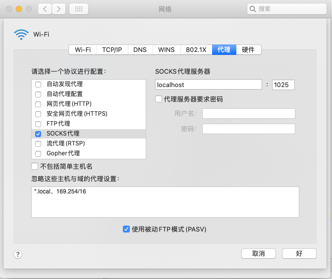

# 快捷键

* 基本操作

  * Command-Z 撤销　
  * Command-X 剪切　　
  * Command-C 拷贝（Copy）　　
  * Command-V 粘贴　　
  * Command-A 全选（All）　　
  * Command-S 保存（Save)　　
  * Command-F 查找（Find）　

* 截图

  Command-Shift-4 截取所选屏幕区域到一个文件　　

  Command-Shift-3 截取全部屏幕到文件　　

  Command-Shift-Control-3 截取全部屏幕到剪贴板　　

  Command-Shift-4 截取所选屏幕区域到一个文件，或按空格键仅捕捉一个窗口　　

  Command-Shift-Control-4 截取所选屏幕区域到剪贴板，或按空格键仅捕捉一个窗

* 隐藏

  * Command-H 隐藏当前程序
  * Command-Option-H 隐藏其他程序

* 关闭程序

  Command-Q 关闭当前程序

* 查单词

  Option-Z （需要存在有道词典）

*  打开搜索

  Command-Space

# 命令行

* 安装brew

  ```shell
  mkdir homebrew && curl -L https://github.com/Homebrew/brew/tarball/master | tar xz --strip 1 -C homebrew
  ```

* 打开Finder

  ```shell
  open <path>
  ```
  
* 软件管理

  * 安装
    brew install mysql //安装mysql

  * 搜索

    brew search mysql //搜索mysql

  * 查看详细

    brew info mysql  //  查找mysql相关信息

  * 更新brew

    brew update   //更新自己的Homebrew

  * 列出待升级软件

    brew outdated  //会显示哪些软件可以升级

  * 升级软件

    brew upgrade   //升级所有软件（后面不加名字）

    brew upgrade mysql //  升级mysql软件

  * 清理

    brew cleanup  //定期清理一些安装包缓存

  * 列出已安装软件

    brew list   //显示已经安装的软件

  * 卸载

    brew uninstall xx //卸载某些软件


# 密钥导入导出

https://www.digicert.com/kb/ssl-support/p12-import-export-mac-server.htm

# 全局代理

iMac的代理功能比Windows强多了， Windows仅支持VPN全局代理， iMac支持各种协议的全局代理

配置地址`Setting-->高级-->代理`

