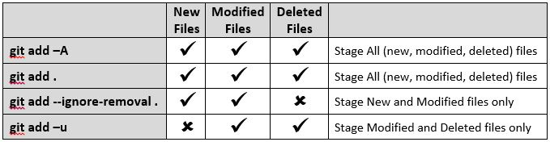

# 一 入门

## 版本控制

Version control is a system that records changes to a file or set of files over time so that you can recall specific versions later

- 局部版本控制系统：所有版本的数据都存在于本地数据库。

  - 缺点：不适合多人协作

  

- 集中式版本控制系统（CVCS）：通过一个服务器来保存所有版本文件，客户端取出最新文件或提交更新。

  - 缺点：服务器损坏时，会对所有人造成影响

  

- 分布式版本控制系统（DVCS）：每个客户端拥有仓库的镜像和历史。因此服务死机时，客户端可拷贝回去。

  > 冗余换可靠性

  

## Git历史

- 起初使用补丁或归档文件来更新Linux内核（1991-2002）
- 商业DVCS（BitKeeper）允许Linux项目免费试用，但最终关系破裂（2002-2005）
- Linus Torvalds（Linux创始人）开发了Git（2005-至今）

## Git概念

### 快照，非微分

当提交数据时（即更新版本时），数据如何存储？

- 其他VCS：每个版本只记录被改变的部分

  

- Git：对你的项目拍摄快照，存入快照的引用。如果拍摄快照时，一些文件未改变，仅存上个版本对应文件的链接。

  

  > 也即每个版本,Git都有改变后文件的完整快照(拷贝), 这样还是通过冗余换可靠性
  >
  > 还多了一个间接层, 即每个版本存的是快照的引用, 增加了可扩展性

### 其他

- 几乎都是局部操作，因为Git对项目有一份完整的拷贝。
- Git保证数据完整性：所有数据在保存前，都会使用SHA-1哈希算法计算校验和。该哈希值是由40个十六进制字符字符的字符串，基于文件内容或目录结构计算出来的，并且Git使用哈希值来引用文件。哈希值类似这样的：`24b9da6552252987aa493b52f8696cd6d3b00373`
- Git仅添加数据：即使你删除数据时，Git也只是记录这个过程。

### 文件状态

| 状态         | 是否标注 | 是否修改 | 是否提交 | 位置        | 描述                                                         |
| ------------ | -------- | -------- | -------- | ----------- | ------------------------------------------------------------ |
| `Committed`  | √        |          | √        | 本地git仓库 | 已是某个项目版本的文件<br />注意, 该状态其实与`Unmodified`是不同视角下的同一状态 |
| `Staged`     | √        | √        |          | 暂存区      | `git add`到暂存区的文件,<br />用以制作下一个要提交的版本的快照;<br />实际上，对于staged状态的数据，git只记录被改变的部分，称之为`index |
| `Modified`   | √        | √        |          | 工作目录    | 即在上个版本的基础上改动过的文件                             |
| `Unmodified` | √        |          |          | 工作目录    | 与上一个版本一致的文件, 即还没改                             |
| `Untracked`  |          |          |          | 工作目录    | git看不到的文件, 如新建的文件.                               |

> 所谓的标注为git已知道该文件的存在
>
> 被标注的, 却被删除, 也算一种修改(`modified`), 但在`git add`命令中会被区分对待. 


> 图中没有`committed`状态, 因为它与`Unmodified`是**不同视角**看待的**同一状态**.

### git工作流

- 提取项目到**工作目录**

- 添加数据更改到**暂存区**

- 你发起一个`commit`，会制作快照，然后永久的存入**git(本地)仓库**（即新版本）。

  > git仓库与暂存区都位于`.git/`目录下

  

## 安装

```bash
sudo apt install git-all
```

## 配置

第一次安装Git后，需要使用`git config`配置一些变量，这些变量可存于三个配置文件中：

- `/etc/gitconfig`：应用于所有用户，配置时加上`--system`

- `~/.gitconfig`或`~/.config/git/config`：应用于当前用户，配置时加上`--global`

- `.git/config`：应用于当前git仓库，配置时加入`--local`，实际上默认为该选项。

  > 后面的优先级高

### 身份

每次提交时，会加入这些信息，表示谁提交的。通过全局配置，只需配置一次，如：

```bash
$ git config --global user.name "John Doe"
$ git config --global user.email johndoe@example.com
```

### 编辑器

提交时，需要写入描述信息，git会打开系统默认编辑器，也可自定义：

```bash
$ git config --global core.editor emacs
```

### Git别名

为git命令起别名, 如

```bash
git config --global alias.log2 'log --all --decorate --oneline --graph'
```

### 检查设置

- 检查所有设置：

  ```bash
  git config --list
  ```

  > 同一键值可能会出现多次，来源于不同配置文件，最后的优先级高

- 检测某一键值

  ```bash
  git config user.name
  ```

### 删除配置

加个`--unset`即可

```bash
git config --global --unset user.name
```

## 获取帮助

- 详细帮助：

  ```bash
  git help <verb>
  ```

- 简易帮助：

  ```bash
  git add -h
  ```

- 在线文档：[Reference](<https://git-scm.com/docs>)

# 二 基础

## 创建git仓库

有两种方式：

- 创建仓库：进入工作目录，执行`git init`，会创建git仓库（`.git`下）。

  > 如果当前目录已有项目文件，可以先track文件（提交到暂存区），然后commit，来初始化第一个版本

- 克隆仓库：执行`git clone <url>`，如：

  ```bash
  $ git clone https://github.com/libgit2/libgit2
  ```

  会获取（pull down）远程仓库的**完整数据**（包含所有版本），并获取（checkout）项目最新版本到工作目录。

  > git支持多种传输协议，如https、ssh等

## 仓库基本操作

### git add

`git add`可将untracked、modified状态的文件添加到暂存区。

> `git add` is a multipurpose command — you use it to begin tracking new files, to stage files, and to do other things like marking merge-conflicted files as resolved. It may be helpful to think of it more as “**add precisely this content to the next commit**”

git version2.x中常用的命令如下：



> 参考：[git add](https://stackoverflow.com/a/26039014/10248407)

### git status

显示当前仓库状态。

### Ignoring Files

当某一类文件，不想添加到暂存区，也不想提示untracked时，可以在`.gitignore`中配置。

**注意, 匹配规则的相对路径是相对项目根路径的; 规则仅为文件名时, 会递归作用到所有目录.**

详细规则如下, 类似正则:

* 作用到文件名:
  * `*`匹配任何字符
  * `[abc]`匹配一个集合内的任意字符; 或`[0-9]`, 表示范围, 0到9
  * `?`匹配单个任意字符

* 作用到目录
  * `**`在路径中匹配嵌套的目录, 如`a/**/z`匹配`a/z`,`a/b/z`,`/a/b/c/z`等

  * 以`/`开始, 避免文件名规则递归作用; 以`/`结束, 表示规则**递归**作用到目录

* 其他
  * 忽略以`#`开始的注释和空行.
  * `!`取反, 即不忽略
  * 后面的规则可覆盖前面的, 即后面的优先级高

例子如:

```plain
# ignore all .a files
*.a

# but do track lib.a, even though you're ignoring .a files above
!lib.a

# only ignore the TODO file in the current directory, not subdir/TODO
/TODO

# ignore all files in any directory named build
build/

# ignore doc/notes.txt, but not doc/server/arch.txt
doc/*.txt

# ignore all .pdf files in the doc/ directory and any of its subdirectories
doc/**/*.pdf
```

### git diff

查看文件具体的改变

### git commit

将暂存区的内容提交。未添加到暂存区的则不会。

```bash
git commit # 之后需要在默认编辑器中输入描述
git commit -m "your description" # 直接写入描述
git commit -a -m 'your description' # 提交前自动将tracked的文件添加到暂存区，然后提交
```

### git rm

在工作区删除文件的同时也在暂存区添加删除操作。

```bash
git rm <file>
# 等于
rm <file>
git add
```


> 记住，git中仅会添加数据，因此删除也是一种数据添加，即添加删除记录

### git mv

通过mv重命名文件，同样也会操作暂存区。

### git show

显示对象的信息, 该对象可以是tags, commits, trees, blobs.

### git checkout

切换到某个分支版本上. 参数可为分支名, 标签名, 版本(commit)校验和.

`git checkout -b <branchName> `该命令创建分支时同时切换过去(移动`HEAD`指针)

> 当chekout到commit上时, 此时处于`detatched HEAD`状态, 修改不能被提交

## 查看提交历史

`git log`按照时间逆序显示所有版本信息, 最先显示的最近提交的版本.

`git log --all --decorate --oneline --graph`能够以字符图形的方式显示历史. 但还是建议使用工具来完成该工作.

> - `--all` 显示所有内容, 包括远程仓库
> - `--graph` 以字符图形方式显示版本
> - `--decorate`显示额外信息, 如版本上的分支名, tag标签, HEAD指针等.
> - `--oneline` 版本信息(commit)显示在一行, 默认short精简显示模式.
>
> 命令记忆法: a dog

## 撤销改变

### 重新提交

`git commit --amend`重新提交当前版本的内容, 如果暂存区存在内容时, 则合并.

> 所谓的重新提交, 指替代当前版本内容

下面修改上次提交的版本, 并加入一个文件

```bash
$ git commit -m 'initial commit'
$ git add forgotten_file
$ git commit --amend
```

### 移出暂存区

使用命令`git reset HEAD <file>...`

全部移出`git reset HEAD .`

### 重置Modified文件

注意, 是重置`Modified`状态的文件, 使用命令`git checkout -- <file>`

全部重置`git checkout -- .`

### 回退提交

```bash
git reset <mode> <commit>
```

 `mode`的三种模式:

* `--soft`:所有改变移出到本地仓库和暂存区
* `--mixed`(默认): 所有改变移出本地仓库, 到暂存区中
* `--hard`: 所有改变丢弃

场景: 如何将远程仓库中的一个commit删除

>方法:
>
>* `git reset --hard <commit>`本地删除
>
>* `git push origin HEAD --force`强制推送

## 远程仓库

当多人合作开发项目时, 需要存在一个远程仓库. 开发者从远程仓库`fetch`(获取)数据与特定分支合并,  开发完后`push`(推送)到远程仓库和特定分支合并. 并且`push`时, 要推送的本地分支是从最新的远程仓库分支中`fetch`的, 否则需要先fetch在本地合并, 再push.

> `pull`就是`fetch`下拉项目和合并分支这两个过程的组合. `push`也是上传与合并过程的组合.

> 远程仓库仅意味着其他地方的仓库, 可以在相同主机上.

远程仓库URL表示, 使用别名简化URL使用. `fetch`后本地仓库也存在着远程仓库的分支, 通过远程仓库名+其分支区分, 如`origin/master`

可以手动设置远程仓库, 也可以隐式设置. 如`git clone`的仓库, 已经默认设置了`origin`的远程仓库

### 显示所有远程仓库

`git remote`显示所有远程仓库, 加上`-v`显示详尽信息.

```bash
$ git remote -v
bakkdoor  https://github.com/bakkdoor/grit (fetch)
bakkdoor  https://github.com/bakkdoor/grit (push)
cho45     https://github.com/cho45/grit (fetch)
cho45     https://github.com/cho45/grit (push)
defunkt   https://github.com/defunkt/grit (fetch)
defunkt   https://github.com/defunkt/grit (push)
koke      git://github.com/koke/grit.git (fetch)
koke      git://github.com/koke/grit.git (push)
origin    git@github.com:mojombo/grit.git (fetch)
origin    git@github.com:mojombo/grit.git (push)
```

第一列为URL的别名, 也即自定义的远程仓库名.

### 添加远程仓库

`git remote add`手动添加远程仓库. `git clone`克隆的项目已添加了`origin`仓库.

### 获取数据

`git fetch <remote>`从远程仓库下拉所有数据, 以`<remote>/<branch>`的形式区分本地仓库的分支. 之后你可以手动合并某个分支到本地仓库的分支上.

> 实际上是下载最新的数据, 忽略已存在的数据.

`git pull <remote> <branch>`可以直接完成下拉和合并两步过程. 如果有tracking信息, 即与远程仓库某个分支关联时, 可直接省略两个参数. 如果未关联, 它会提示你如何关联的.

> 克隆的项目默认配置好了tracking信息

### 推送数据

`git push <remote> <branch>`完成上传与合并的功能. 如果有tracking信息, 即与远程仓库某个分支关联时, 可直接省略两个参数. 如果未关联, 它会提示你如何关联的, 或者见第三章远程分支.

> 注意, 一次只能上传一个分支的, 如果远程仓库无该分支则会被创建.
>
> 克隆的项目默认配置好了tracking信息.

### 查看仓库详细

`git remote show <remote>`可以查看某个仓库的具体信息. 一个复杂的例子如下:

```bash
$ git remote show origin
* remote origin
  URL: https://github.com/my-org/complex-project
  Fetch URL: https://github.com/my-org/complex-project
  Push  URL: https://github.com/my-org/complex-project
  HEAD branch: master
  Remote branches:
    master                           tracked
    dev-branch                       tracked
    markdown-strip                   tracked
    issue-43                         new (next fetch will store in remotes/origin)
    issue-45                         new (next fetch will store in remotes/origin)
    refs/remotes/origin/issue-11     stale (use 'git remote prune' to remove)
  Local branches configured for 'git pull':
    dev-branch merges with remote dev-branch
    master     merges with remote master
  Local refs configured for 'git push':
    dev-branch                     pushes to dev-branch                     (up to date)
    markdown-strip                 pushes to markdown-strip                 (up to date)
    master                         pushes to master                         (up to date)
```

输出信息分别有

- 远程仓库别名, 上传和下拉的URL
- 本地仓库当前分支
- 远程仓库所有分支, 还会显示该分支在本地仓库的情况, 如是否被tracked, 在本地仓库中是否存在等
- 在`push/pull`命令中, 本地仓库中分支与远程仓库分支的关联情况, 如有关联时, `push/pull`命令可省略参数

### 重命名和删除

`git remote rename <oldName> <newName>`重命名仓库

`git remote remove`删除本地仓库中远程仓库的数据.

## Tag(标签)

git允许为某个版本(commit)打上发型(release)版本标签, 如`v1.0`, `v2.0`等. 

tag分两种:

- `Annotated Tag`: 除了标签名, 还能附带更多的信息
- `Lightweight Tag`: 仅有标签名

### 显示标签信息

- `git tag`以字符顺序显示所有标签名
- `git tag -l 'v1.8.5*'`显示匹配成功的标签名, 可以使用它通配符.
- `git show <tagname>`显示某个标签详细信息

### 添加标签

```bash
git tag [-a] [-m <msg>] <tagnmae> [<commit>]
```

`-a`声明标签为`Annotated`类型的; `-m`指定标签详细信息, 同时隐含了`-a`选项. 无`<commit>`时, 默认为当前版本打标签.

### 推送标签

`git push`默认不会传送标签信息到远程仓库, 需手动: 

- `git push origin v1.5` 一次推送一个标签
- `git push origin --tags` 推送所有标签

> `pull`远程仓库时, 也会同时下载标签信息.

### 删除标签

- `git tag -d v1.4` 删除本地标签
- `git push origin --delete <tagname>` 删除远程仓库的标签

> 疑问: 重新推送标签能删除标签吗?

### 切换版本

`git checkout`用于切换版本, 同样参数可以是`<tagname>`

如`git checkout 2.0.0`, 切换后会进入`detached HEAD`状态, 此状态下的提交会被忽略.

通过切换版本时创建新分支来解决这个问题, 如`git checkout -b version2 v2.0.0` 此时提交是在另一个分支上进行的.


# 三 分支

## 仓库存储原理

分支是什么? 先看看仓库如何存储数据.

当文件被添加到暂存区时, git会计算文件的校验和(`SHA-1`算法), 校验和与文件本身组成一个**blob对象**. 

当提交((commit)暂存区的内容时, git会计算目录的校验和, 与目录内的文件的blob对象组成**tree对象**.

> 暂存区内的文件是被改变过了的, 可得到新的blob对象, 而未改变的文件则取上个版本的文件的blob对象引用放入tree对象中.

之后, git创建一个**commit对象**, 含有项目根目录对应的tree对象, 作者信息, 指向上一个版本的指针等等.

总之, blob对象表示文件快照, tree对象表示目录快照, commit对象含有指向根tree对象的指针, 因此commit可以找到本次版本所有数据的快照.

如下所示, 三个修改了的文件, 一个目录的提交:


> 这里的commit对象忽略了上一个版本的commit指针

当提交多次后


> 这里的snapshot表示项目文件目录的整体快照

而**分支**仅仅只是指向commit对象的指针, **标签Tag**也是指向commit对象的指针, **HEAD**表示当前开发的版本, 通常指向分支. 当HEAD指向标签和commit对象而非分支时, 提交会别忽略, 这也是标签和分支的区别之一.


当提交时, HEAD指针和对应的分区都会指向新的版本(commit).

切换分支时, 工作目录下的文件会被更换到该版本快照的状态, 但是工作目录或暂存区中未提交的内容会保留下来, 但如果与切换版本冲突了, git会不允许切换分支.

## 分支操作

- 查看分支: 
  - `git branch`
  
    或`git branch -v`
  
    或`git branch -a`(能查看远程分支)
  
  - 还是使用`git log`命令, 加上`--decorate`选项.
  
- 创建分支: `git branch <branchName>`

  > 默认是在当前commit上新增分支指针, 也可在创建分支时强制移动分支节点,如:
  >
  > ```bash
  > git checkout -b <new_branch> [<start point>]
  > ```
  >
  > 此时新分支指向`<start point>`

- 切换分支: `git checkout <branchName>` ,通过移动HEAD指针实现. 加上选项`-b`可以创建并切换到该分区.

- 删除分支: `git branch -d <branchName>`

- 移动分支指针?

## 合并分支

对于合并分支, Git有两种方案: `fast-forward`和`three-way merge`

如下图所示, HEAD指向master分支, 要合并hotfix分支, 执行命令`git merge hotfix`


因为master分支是hotfix的祖先分支, 合并只需要简单的移动master指针到hotfix即可, 属于`fast-forword`方案.


------

复杂一点的情况, master合并iss53分支, master与iss53有一个共同祖先版本, 属于`three-way merge`, 因为要靠三个版本做参考来合并.


该方案存在两个过程: 自动创建新的快照并提交, 如


但是有个问题, 如果master和iss53分支都改动了相同位置的代码, git处理不了, 只能交给用户自己处理. **因此仅创建了快照, 交由用户解决冲突并提交**. 通过`git status`可以知道哪个文件冲突了, 并且git做了标志.

## 远程分支

这节算是远程仓库的进阶内容

> 这里说的远程分支指的是服务器中仓库下拉后在本地的拷贝, 不是服务器上的分支.

上面讲到, Git仓库commit对象记录着一个版本的快照, 而分支仅仅是指向commit对象的指针. 从远程仓库中下拉所有数据后(fetch), 所有版本信息都是以commit对象存在, 如果本地仓库已存在部分commit对象, 则不会下拉该数据. 为了区分远程分支, 远程分支名会加上仓库前缀, 如`origin/master`, 如下图所示:


> 可以看到, 远程仓库的commit和本地的仓库的commit是不做区分的.

注意, 当远程分支(在本地的拷贝)没有及时更新时, 服务器上的仓库更新, 可能会造成不一致, 因此导致push会失败. 所以push时最好下拉合并(pull)下远程分支. 

还有个概念: **Tracking Branches**, 之前提到过的. 作为一个Tracking分支, 使用`git pull`和`git push`时可以省略远程分支的名字, 因为它本身已经记录了之间的关联关系. 即此而已. 什么时候隐式成为tracking分支? 复杂..不深究, 但是需要时可以手动设置关联关系, 如

```bash
git branch --set-upstream-to=origin/test
#或者在push的时候顺便设置关联
git push -u origin master
```

然后使用`git remote show <remote>`查看远程仓库内分支的状况, 或者用如下命令:

```bash
$ git branch -vv
  iss53     7e424c3 [origin/iss53: ahead 2] forgot the brackets
  master    1ae2a45 [origin/master] deploying index fix
* serverfix f8674d9 [teamone/server-fix-good: ahead 3, behind 1] this should do it
  testing   5ea463a trying something new

```

可以看到本地分支与远程分支的关联情况; `ahead`表示本地分支领先远程分支多少步; `behind`表示服务器中分支领先远程分支多少步.

删除服务器中的分支: `git push <remote> --delete <branch> `

> 那添加呢? push时服务器中不存在则自动添加.

## Rebase分支

rebase, 重置当前分支的base(起始点)到另一个分支末处, 这是一个优化提交历史的方案.

概念抽象, 这里举个例子, 现在rebase hotfix分支到master分支上, 就是将两个分支的提交合在一起.

```
//当前处于hotfix分支, 现在rebase到master上
git rebase master
```


首先找到两个分支的分岔口`c0`, 得到hotfix分支的起始点`c2`, 将其移接到master分支的末尾处c1.


注意, 这里的`c2'`, `c3'`可能与原先的不同, 因为`c1`可能与`c2`,`c3`存在冲突. 那么rabase的过程中解决冲突的方式如下:

1. 若`c1`与`c2`冲突, 让用户去解决, 得到`c2'`
2. 若`c2'`与`c3`冲突, 让用户去解决, 得到`c3'`

接下来, 用户可以选择让master合并hotfix, 但这不是rebase的功能了.

> 命令行怎么用? 命令自身会有提示的...

> 参考[Git Branching - Rebasing](https://git-scm.com/book/en/v2/Git-Branching-Rebasing)

# 四 其他

## 分支管理


> 参考[实际项目中如何使用Git做分支管理](https://zhuanlan.zhihu.com/p/38772378)

## Git for Windows

Git for Windows在Windows上提供了git命令, Bash Shell, MinTTY终端和大部分Unix常用命令.

> 与

Git for Windows版除了有git命令, 还附带了终端Git Bash ( 或者叫MinTTY? ), 与Windows默认命令终端相比, 有更好的选中功能, 并使用Unicode字符. 当Windows交互软件需通过`winpty`去运行, 否则会乱码?

> 如果使用Windows默认终端, 需要自己去配置Unicode字符编码.

> 推荐使用Cmder ,终端更好用, 还自带Git for Windows.

## 问题

### git status乱码

尽管Git使用了`UTF-8`字符编码, 但`git status`仍然乱码, 这是[core.quotePath](https://git-scm.com/docs/git-config#Documentation/git-config.txt-corequotePath)被设置了的缘故, 关闭即可:

```bash
git config --global core.quotepath false
```

### SSL问题

具体问题忘了, 但输入以下语句解决:

```bash
git config --global http.sslVerify false
```

### Http协议一直登陆

可以考虑开启缓存, 暂时保存密码

```bash
$ git config --global credential.helper cache
```

默认保存15分钟, 可以设置长一点, 如保存一个月

```bash
$ git config --global credential.helper 'cache --timeout 2592000'
```

-------

也可以选择长期保存, 即保存在本地文件中

```bash
$ git config --global credential.helper store
```

默认保存在 `~/.git-credentials`中, 可以设置保存在其他文件中

```bash
$ git config --global credential.helper 'store --file ~/.my-credentials'
```

### 换行符转换

有三种方式:

1. `core.autocrlf=true`

   checkout时, 转化为`CRLF`; commit时, 转化为`LF`

2. `core.autocrlf=input`

   checkout时, 无操作; commit时, 转化为`LF`

3. `core.autocrlf=false`

   不做任何转化

> checkout指的是从仓库中获取数据时, 该仓库可以是远程仓库, `git pull`也算是一种checkout的过程.

### error: gnutls_handshake() failed

认证时, ` gnutls `包工作有问题, 可关闭校验

```shell
git config --global http.sslVerify false
```

可能会受到中间人攻击, 但是我不关了它我就`push`不上了, 无可奈何呀....

-----

最新证实!! 这是网络原因造成的, 所以发生了握手抖动, 如我这湖南联通的卡访问不了Github了.

# 参考

- [书](https://git-scm.com/book/en/v2)
- [未读内容](https://git-scm.com/book/en/v2/Git-Branching-Rebasing)


