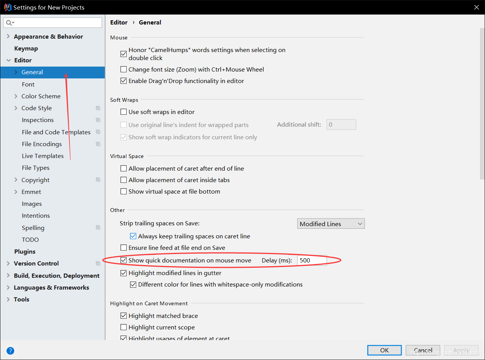

[TOC]

# 一 介绍

Eclipse与Intellij IDEA哪个好？很多人支持idea，在昨日我的eclipse崩溃之后，我决定尝试下idea，发现还行吧。。

# 二 IDEA配置
## 安装
idea自带jre1.8以支持idea运行，但是我们安装idea之前还是需要安装JDK用以开发，JDK要配置好环境变量。

idea分为[旗舰版][1]和社区版，虽说前者收费但对于学生来说还是免费的。因此，首先在idea官网上注册个账号（随便个邮箱），然后用学生邮箱认证。安装idea旗舰版时便可以登录该账号免费使用。如果不是学生，则参考网上破解教程。

安装后可以选择UI主题和禁用不用的插件，将用不到的插件禁用可以加快idea体验（不用担心，以后仍然可以设置回来）：


最后会进入该界面，在这个界面可以进行**全局配置**。


## 配置Maven
idea自带maven，但不是最新版本，也不好配置它，因此最好自己配置一个。

首先在[官网][2]上下载最新版本，然后解压。不用设置环境变量，可直接在idea中配置：

> 貌似使用前要设置JAVA_HOME


Maven的Runner界面可以选择Maven构建项目使用的JRE，默认使用项目JDK，因此不用设置。

>在使用maven时，右键项目->maven-reimport可将maven配置（如JDK编译版本）反应到idea中。

配置maven使用阿里云仓库，加快下载速度，找到maven配置文件`setting.xml`, 在`mirrors`元素下添加:
```xml
<mirror>
    <id>nexus-aliyun</id>
    <mirrorOf>*</mirrorOf>	
    <name>Nexus aliyun</name>
    <url>http://maven.aliyun.com/nexus/content/groups/public</url>
</mirror>
```
## 配置tomcat
下载最新版[tomcat9.0][3]，不用配置环境变量，可直接在idea中配置。同样在全局配置的setting中配置：

## 解决乱码
乱码是由于不同地方编码不同意造成的，解决乱码的思路是整个项目中哪里用到编码，就设置哪里的编码，如：
* 运行idea用到了jvm，需要设置编码；
* maven用于构建项目，需要设置编码，但在`pom.xml`中设置；
* idea中`Build，Execution，Deployment`中还有Compiler，需要设置吗？我认为不用，因为项目的编译、构建已经交给了maven
* 项目文件的编码设置。
* tomcat运行项目，需要设置编码。

下面就根据这个思路来解决idea中乱码的现象：

首先，打开全局配置**Edit Custom VM Options**，在最后添加一行`-Dfile.encoding=UTF-8`，配置运行idea的jvm的参数：


统一项目中文件的编码，打开全局配置setting：


配置tomcat运行配置，填入`-Dfile.encoding=UTF-8`

其他的乱码问题就是代码问题了，极力推荐博客：[IntelliJ IDEA 使用 TOMCAT 中文乱码的各种问题](https://blog.csdn.net/u012611878/article/details/80723491)
## 其他配置
鼠标移至元素上时显示document（javadoc）：

每个字母都提示且不区分大小写：

JDK没有源码的情况下，想要`Shift+F1`（用浏览器打开帮助文件）生效，需要配置：

为java文件头添加javadoc注解：


如果喜欢unix风格的换行符:


[1]:https://www.jetbrains.com/idea/download/#section=windows
[2]:http://maven.apache.org/download.cgi
[3]:https://tomcat.apache.org/download-90.cgi

# 三 maven web项目
## 创建项目
点击create new project


创建后文件夹基本是缺少的，于是需要创建这些文件，打开项目配置对话框：


>也可直接创建好目录，然后右键项目-->maven-->reimport
## 配置Run/Debug
项目如何运行？运行的方式需要我们自己配置，但好在提供了模板：


运行后会弹出指定网页，然后更改index.jsp，直接进入浏览器刷新，内容是不是已经改变了？**注意，它自动生成的文件很多都仍需修改！！**

# 四 必懂的知识
即使成功运行了，也是云里雾里的，这里来进行介绍。

## project和module
一个project可以有多个module，project能够方便的管理modules和在它们之间共享配置，如sdk、languge、compile等配置，详细打开`File|Project Structure`。

module与project一同被创建出来，每个module都是个独立的实体，可以拥有自己的设置，可以被配置用于开发框架相关的应用。modules之间可以相互应用（依赖）。

在这里想说的是，tomcat的配置可以随意更改，并不会影响到其他module，tomcat的配置也不会影响module，除非在`run Configurations`中配置。

## 全局或项目配置
每个新项目创建时会从全局配置中获取配置，进入项目后可以更改配置，但不会影响其他的项目。（并不是所有配置都这样）

## 本地，远程运行配置
可以为server进行本地或远程配置。通常为安装在本地的server设置local配置，这些配置包括server如何启动。当执行本地配置时，idea会启动server。而远程配置不会启动server，它只会连接server，然后发布、调试artifact（项目）。

因此，是否使用本地或远程配置的取决于server是否允许重启，而不是它的物理位置。

执行运行配置的过程：
1. 编译和构建artifact
2. 启动server或连接server
3. 发布artifact
4. 打开指定url

参考：[Working with Server Run/Debug Configurations](https://www.jetbrains.com/help/idea/creating-run-debug-configuration-for-application-server.html)

## 热部署
这里所谓的热部署就是，修改的部分程序直接加载到内存，并替换旧的部分程序。然而idea的热部署功能有一定限制。在`run configuration`可以进行相关配置：

* `On update action`：当点击update按钮后，会执行相应的更新动作。
* `On frame deactivation`：当idea失去焦点时执行相应的更新动作。

有些选项值只有在特定的配置下可用，受不同运行配置（local or romote）、发布方式（war or war exploded）影响。因此下拉列表中显示的都是可用的选项值。

所有选项值如下：

| Option                       | Description                                                  | Available for                                                |
| :--------------------------- | :----------------------------------------------------------- | :----------------------------------------------------------- |
| Update resources             | All changed resources are updated (HTML, JSP, JavaScript, CSS and image files). | Exploded artifacts in local configurations                   |
| Update classes and resources | Changed resources are updated; changed Java classes (EJBs, servlets, etc.) are recompiled.                                    **In the debug mode, the updated classes are hot-swapped**.                    In the run mode, IntelliJ IDEA just updates the changed classes in the output folder.                    Whether such classes are actually reloaded in the running application,                    **depends on the capabilities of the runtime being used**. | Exploded artifacts in local configurations                   |
| Hot swap classes             | Changed classes are recompiled and reloaded at runtime.                This option works only in the debug mode. | Packed artifacts in local configurations; exploded and packed artifacts in remote configurations |
| Redeploy                     | The application artifact is rebuilt and redeployed. The operation may be time-consuming. | Exploded and packed artifacts in local and remote configurations |
| Restart server               | The server is restarted. The application artifact is rebuilt and redeployed.                The operation may be very time-consuming. | Exploded and packed artifacts in local configurations        |

看起来将`On frame deactivation`配置成`Update classes and resources`，能够达到热部署的目的，然后实际上不好用。第一，只有切换到浏览器上要等上一段时间才可刷新；第二，通常情况下，热部署是有限制的，即只能更改方法体才会有效，不能添加新的字段或方法。但idea推荐使用另一种jvm，DCEVM，它能够克服上述问题。

使用我上面的配置，虽然并不能进行热部署，也是挺方便的，能够自己控制更新artifact的方式。


参考：
[Updating Applications on Application Servers](https://www.jetbrains.com/help/idea/updating-applications-on-application-servers.html)
[Run/Debug Configuration: Tomcat Server](https://www.jetbrains.com/help/idea/run-debug-configuration-tomcat-server.html)

## idea内部工作流程
在idea中，配置好后直接点击运行Debug或Run就可以运行程序看到效果了。那它背后又做了什么？Maven项目是由Maven构建的，又如何体现？

Maven项目中，项目的构建自然交给了Maven来完成，一些配置也交给了Maven来配置（pom.xml），因此idea中自己的一些项目配置是不需要的（或者无用的，并且可能会冲突），可以使用maven-->reimport将maven配置更新到idea中。

项目在tomcat运行之前是需要先构建的，可以明确指定maven的生命周期来构建项目，如：

也可以让idea来购将项目，在工具栏build中可以手动购将项目。由于是Maven项目，idea会自动使用Maven来构建。我猜构建生成的artifact类型为`war exploded`时使用maven的compile生命周期来生成；artifact为war时，使用了声明周期package来生成。

IDEA中构建的几个选项如下所示：
* **Build**：只会构建更新过的文件。第一次时构建时，会构建整个项目
* **Clean**：删除构建的内容
* **Rebuild**：重新构建整个项目，相当于Clean-->Build

项目构建后的产物称为**artifact**（点击项目F4可看到），然后才可以被使用。接下来需要配置Run/Debug Configurations，也就是artifact的运行环境，如tomcat。tomcat运行环境配置中的Deployment配置的就是运行哪种artifact，如：

可以看出，使用的配置模板已经自动配置了构建方式（图中下方），因此在run或debug时，我们不必手动构建项目。

----------
可以看出，运行项目需要先构建项目，产生artifact，在将artifact运行在配置的环境中。正是由于idea都默认为我们配置好了，所以我们只需几步就能运行项目。但缺点就是屏蔽了我们对idea运行过程的理解。

>参考：
>* [Working with Artifacts](https://www.jetbrains.com/help/idea/working-with-artifacts.html#artifact_def)
>* [Deployment tab](https://www.jetbrains.com/help/idea/run-debug-configuration-tomcat-server.html#deployment)
>* [Debug maven application in Intellij Idea](https://stackoverflow.com/questions/22571037/debug-maven-application-in-intellij-idea)

## 文件保存
在使用idea时，几乎不用手动`ctrl+s`保存文件，它会自动为你保存。默认设置在`Appearance & Behavior-->System Settings`中可以看到，如下图所示：

在跳出编辑区域、idea时都会自动保存，运行项目时也会自动保存，等等。并且保存方式为`safe write`，即：与简单的更新文件相反，safe write会写入一个临时文件，然后删除源文件，将临时文件名改成源文件名。

这样方式会造成问题，如会导致webpack的热更新失败，因此最好去掉。

> 在linux中, 不用取消safe write, webpack的热更新也生效.

## 关于Maven

Maven是一个构建项目的工具, IDEA自身也有构建项目的功能. 

普通项目会用到IDEA自带的构建功能, 在`Run/Debug Configurations`配置它的构建配置.

Maven项目中, IDEA会用Maven来构建项目, 但不会完全交由Maven构建.

> 如IDEA通过Maven构建项目时并不会执行Maven完整的生命周期, 如测试.

构建配置仍由IDEA管理, 但是POM文件中的构建配置可以反映到IDEA中, 通过`reimport`按钮.

> 或者在settings中配置自动reimport

# 五 快捷键

快捷键不用死记，一般右键或者工具栏中都有。

## 问题提示及修复

* `Ctrl+space`(不知道怎么用): basic code completion.call twice ,then show more
* `Ctrl+Shift+space`: 方法调用时智能提示. intelligently suggestions.call twice ,then show more
* `Ctrl+P`:参数提示
* `Alt+Enter`:快速修复问题

## 查看,定位或跳转

* `Ctrl+Q`:查看类或方法的JavaDoc文档

* `Shfit+F1`:在浏览器中查看JavaDoc文档

* `Ctrl+B`或`Ctrl+LMouse`：导航到类,方法,变量声明处.

* `Ctrl+Alt+LMouse`: 快捷进入实现类

* `Alt+F7`或`Ctrl+LMouse`: 找到变量,方法和类被用到的地方

* `Ctrl+H`: 查看类继承结构

* `Ctrl+Alt+Arrow`: 历史跳转

  > 如`Ctrl+LMouse`跳转到方法声明处, `Ctrl+Alt+<--`跳回去.


## 搜索

* `Shift->Shift` 搜索文件, Symbol, 类, 动作等.

* `Ctrl+Shift+F`: 全局搜索代码

---------
## 窗口

*  `Esc`:move the focus to the editor.
* `alt+number`：打开相应的窗口。
* `Shift+Esc`或`Ctrl+Shift+F12`：隐藏所有工具窗口
* 关闭当前Tab: `Ctrl+F4`
* 查看所有窗口和最近使用文件`Ctr+E`

------------
## 便捷操作

* `sout+enter`:product `System.out.println(“”)`
* 代码格式重排: `Ctrl+Alt+L`
* 注释:`Ctrl+/` 或`Ctrl+Shift+/`
* 优化引入: `Ctrl+Alt+O`
* 新建内容:`alt+insert`
  - 编辑区: 相当于`generate...`
  - 其他窗口: 相当于右键+new, 前提是选中某一项.
- 收起代码块:`ctrl+.`

----

* `Shift+Enter`跳转并新增下一行
* `Ctrl+Alt+Enter`跳转并新增上一行
* `Shift+F6`标识符重命名

## 书签

* `F11`设置或取消书签
* `Shift+F11`查看书签

## Git

* 提交 `Ctrl+K`

  > 在弹出的窗口中, 键入`Ctrl+Alt+K`, 可同时提交并推送.

* 推送 `Ctrl+Shift+K`

## 其他

*  `Ctrl+O`:override methods of the base class.
*  `Alt+Insert`:generate getter and setter method.
*  `Ctrl+W`:extend selection
*  `Alt+F8`:evaluate the value of expression when debugging.
----------
* `Ctrl+N`:quickly open class.first press the key and then typing the name of class.
* `Ctrl+Shift+N`:open any file in your project in a similar way.
----------
* `Ctrl+F12`:navigate in the currently edited file.
*  `Shift+F6`:rename classes,methods and variables of all places.
*  `Alt+F1`:quickly select the currently edited element.
*  `Ctrl+Alt+T`:surround with.can used to catch exception automatically.
*  `Ctrl+Alt+B`:navigate to the implementation of an abstract method at caret.

# 六 纯前端项目

## 传统方式

### 无服务器

通过`New-->Project...-->Static Web`，可以看到很多项目类型，我们选择`Static Web`，其他的只不过已经预置了相应的库而已。

与上面操作一致，我们需要配置`Run/Debug Configuration`，我们有两种选择，运行在tomcat服务器中，或通过JavaScript Debug运行。当然，纯前端项目使用JavaScript Debug就好了，并且也不用手动配置，直接在想要运行html的窗口中直接右键，点击Run或Debug选项，它会自己配置好Configuration，并打开默认浏览器。

想要实时将自己对html的修改反应到浏览器（这里使用chrome）上，需要安装LiveEdit，在[LiveEdit][61]中找到与自己idea版本兼容的LiveEdit下载，然后在idea中安装：

>如果网络好的话，可以直接在idea中安装。

然后在chrome应用商店中下载插件支持（[JetBrains IDE Support][62]），在idea配置，配置如下：

最后直接右键Debug，并且LiveEdit只在Debug环境下才有效！

现在可以愉快的写前端代码了~

[61]:https://plugins.jetbrains.com/plugin/7007-liveedit
[62]:https://chrome.google.com/webstore/detail/jetbrains-ide-support/hmhgeddbohgjknpmjagkdomcpobmllji?hl=en

### 使用tomcat服务器
在tomcat运行配置界面，勾选`with JavaScript debugger`时，再配合LiveEdit使用，java web项目也能修改前端代码时，实时预览了！


### LiveEdit不足
* 在使用过程中，发现LiveEdit对css反应不是智能，有时修改还需手动保存才能更新
* js脚本名为index.js时不能设置断点，并且控制台不是很好用。
* 控制台和打了马赛克似的（和idea配置有关）
## Vue项目

Vue提供了Vue-CLI工具, 已经提供编译和构建功能. IDEA仅作为一个编辑器, 提供语法自动补全,提示功能.

# 七 工具

## 热更新

热部署有很多中方法, 其中JVM热更新是Idea默认支持的, 只要运行中重新构建项目就能触发热更新. 但也有局限性, 只能修改方法内的代码, 修改方法原型, 类字段什么的, 就会失败.

这里介绍**JRebel插件**, 它**几乎没有限制**, 修改代码后便可热更新.

[使用步骤](https://jrebel.com/software/jrebel/quickstart/intellij/?run=ide#!/installation):

1. 安装: 在`plugins`中安装`JRebel for Intellij`

2. 注册: 见博客[JRebel无限制版](https://blog.csdn.net/lawsonjin/article/details/76422807), 关注其公众号**不太污君**,并回复**jrebel认证服务器**, 获取url并填入, 邮箱随意填

3. 项目配置: 打开`JRebel Panel`, 勾选加载模式, 会生成`rebel.xml`文件

   > 貌似不用配置也行, `settings`中也配置了

4. 启动: 以`Run|Debug with JRebel`的方式启动应用, 它会添加一个代理为你热更新.

5. 热更新代码: 重新构建项目后,便可以触发

   > 据说[Enable automatic compilation](https://jrebel.com/software/jrebel/quickstart/intellij/enable-automatic-compilation-in-intellij-idea/)后能提升体验感? 暂时没感觉

注意点

* 发现, 如果当前函数正在运行, 同时热更新该函数,**该函数**会更新失败. 

## JShell Console

一个可以实时计算Java代码片段并返回结果的工具, 类似浏览器的Console, 但功能远没有浏览器强大. 运行JShell, 需要JDK9的支持.

使用:

1. 打开JShell, 选择`Tools | JShell Console`

2. 输入代码
3. `Ctrl+Enter`运行

不知道它运行机制是怎么样的, 将就着用.

JShell可以使用项目依赖的库, 如果还想访问自身项目的类, 需要将项目的输出Jar包添加到自身的 library 下, 操作如下:

1. Open the **Project Structure** dialog Ctrl+Shift+Alt+S and select **Libraries** in the left part.
2. Click , select **Java**, and specify the location of the output classes of your project.
3. Click **OK** to apply the changes.

> 小评
>
> 自动补全体验差, 还没有`Main()`函数方法, 差评!
>
> 自动补全功能差, 差评!

## File Watchers

文件自动保存后就触发一个命令, 如编译. 十分适合前端各种技术, 如SCSS,Babel,TS等, 并且大众技术也有默认的配置.

> 参考[File Watchers](https://www.jetbrains.com/help/idea/using-file-watchers.html)

#  其他

## 清除缓存
idea会缓存很多文件，如果系统运行错误了，则需要清除缓存，如`File | Invalidate Caches/Restart`
## 模板文件
mybatis的xml映射文件经常被使用，如果不安装插件，则需要自己配置模板文件：
1. File-->New-->Edit File Templates...
2. 在File标签页中，新建一模板，模板名：`Mybatis Mapper File`，后缀：`xml`
3. 添加内容：
	```xml
	<?xml version="1.0" encoding="UTF-8" ?>
	<!DOCTYPE mapper
	  PUBLIC "-//mybatis.org//DTD Mapper 3.0//EN"
      "http://mybatis.org/dtd/mybatis-3-mapper.dtd">
	<mapper namespace="${PACKAGE_NAME}.${NAME}">

	</mapper>
	```
## 解决markdown字体模糊
主要是因为idea自带markdown插件（`markdown support`）太垃圾，禁用，然后下载插件`markdown navigator`就好了。

## Line Ending

设置行换行符

`Editor`->`Code Style`->`Line separator`, 然后设置.

## 配置Windows Defender

再Idea进行大量文件操作时, Windows Defender会实时扫描, 造成Idea构建速度变慢. 因此, 可将相关目录添加至非扫描目录中.

步骤如下:

1. 按`Win`键, 输入**安全性概览**
2. 点击**病毒和威胁防护**
3. 点击**"病毒和威胁防护"设置**下的**管理设置**
4. 找到排除项, 点击**添加或删除排除项**
5. 然后将项目目录添加进去即可.

## 不能识别Maven模块

找到Maven模块的`pom.xml`文件, 右键`as maven project`

## JavaScript语言版本

`settings/Language&Frameworks/JavaScript`中将语言版本修改成ES6

## 调试器栈溢出

默认的, 如果对象有实现`toString()`方法时, 则会在变量旁打印`toString()`输出值, 很有可能是该方法造成的溢出.

如, 我写了个节点`Node`,含指向父节点的指针, 形成了回路, 造成调试器一直栈递归, 直到溢出.

解决方案:

1. 右键调试的数据查看视图, 选择`Customize Data Views...`, 取消`Enable toString() object view`的勾选
2. 或者, 重写类的`toString()`方法, 防止递归调用.

## 不能通过Run Configuration运行nuxt项目

若在命令行中, 可输入下面命令运行

```shell
npm run dev
```

Idea中以如下配置运行却不行


> `dev`脚本内容: `nuxt`

因为这种方式不会去执行项目中的`nuxt`命令, 需添加全局nuxt包, 如

```shell
cnpm install -g nuxt
```

一般此时可以运行了.

但我这又出问题了, 我的node-sass是在WSL中, 即Linux环境下安装编译的, Idea则在Windows运行, 因此冲突了. 

需要删除`node_modules/`目录, 并在Windows环境下重新安全.

> 此时又出问题了, WSL又不可以执行跑项目了, 没办法, 二者不可兼得~

# 参考

* [idea download][1]
* [maven download][2]
* [tomcat download][3]
* [IntelliJ IDEA 乱码解决方案 （项目代码、控制台等）](https://www.cnblogs.com/vhua/p/idea_1.html)
* [两分钟解决IntelliJ IDEA中文乱码问题](https://blog.csdn.net/m0_37893932/article/details/78280663)
* [解决SpringMVC、tomcat、Intellij idea、ajax中文乱码](https://blog.csdn.net/u013014636/article/details/72357415)
* [IntelliJ idea鼠标移动到类上显示文档document（javadoc）内容](https://blog.csdn.net/u013905744/article/details/73162294)
* [IntelliJ IDEA + Maven创建Java Web项目](https://www.cnblogs.com/davidgu/p/5887938.html)
* [IntelliJ IDEA修改web项目访问路径](https://blog.csdn.net/yuqin1231235/article/details/51783079)
* [Working with Server Run/Debug Configurations](https://www.jetbrains.com/help/idea/creating-run-debug-configuration-for-application-server.html)
* [Updating Applications on Application Servers](https://www.jetbrains.com/help/idea/updating-applications-on-application-servers.html)
* [Run/Debug Configuration: Tomcat Server](https://www.jetbrains.com/help/idea/run-debug-configuration-tomcat-server.html)
* [IDEA 服务器热部署详解（On Update action/On frame deactivation）](https://blog.csdn.net/w15321271041/article/details/80597962)
* [Intellij IDEA 4种配置热部署的方法](https://www.cnblogs.com/jcook/p/6910238.html)
* [tomcat中war 和 war exploded的区别](https://blog.csdn.net/weixin_36210698/article/details/72585429)