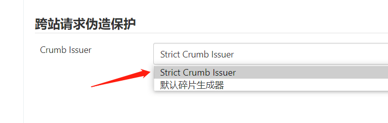
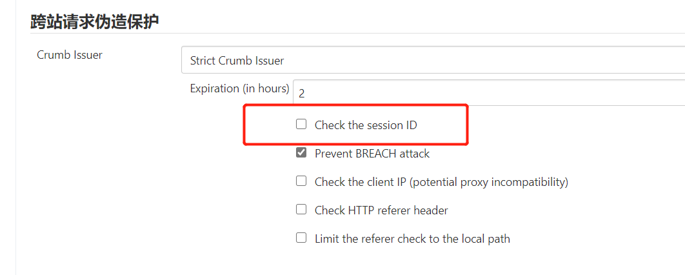

* Docker安装
  * https://www.jenkins.io/doc/book/installing/docker/
  * https://github.com/jenkinsci/docker/blob/master/README.md

* 使用页面403问题

  * 问题根源

    增强了CSRF功能

    https://www.jenkins.io/doc/upgrade-guide/2.176/

  * 临时解决方案---刷新, 不断重试

  * 长久解决方案---禁用

    1. 安装Strict Crumb Issuer插件

    2. 在全局安全配置中, 使用该插件

       

    3. 取消`Check the session ID`

       

* 语言切换

  1. 安装插件`Locale plugin` , 该插件提供了语言切换功能

  2. Manage Jenkins --> Configure System --> Local

     中文填入`zh_CN` , 英文填入`en_US` , 同时勾选Ignore browser preference and force this language to all users

