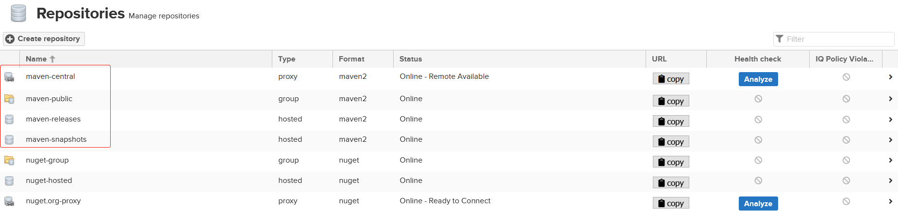
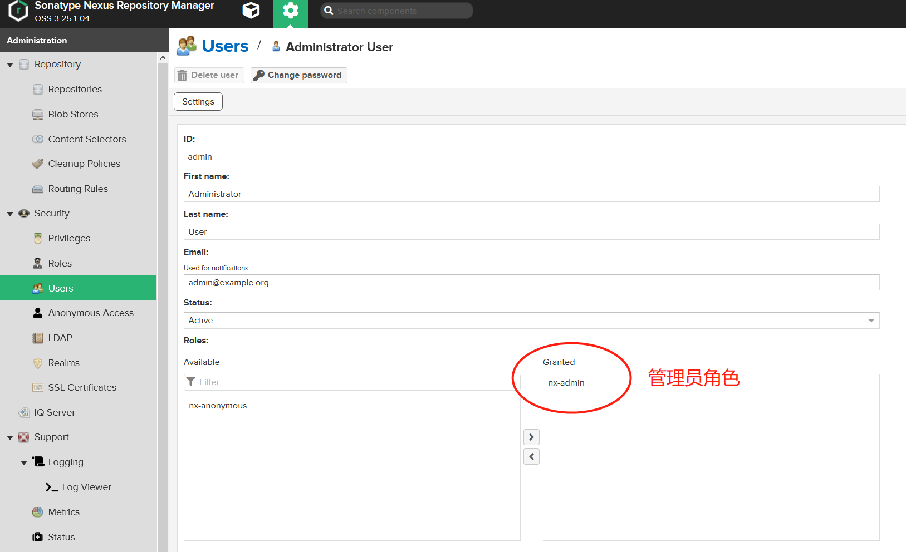

[TOC]

# 一 Start

## 概述

构建一个项目通常由多个任务组成, 如下载依赖,放入classpath下,编译源码,运行测试,打包,部署等. 而maven则是一个自动化这些任务的工具.

Maven核心上是一个执行**插件**的框架，所有的工作都由插件完成。插件提供了很多goal，goal可以挂在在构建的不同生命周期中运行. 在**super pom**(见2.2.2小节)中提供了默认插件, 以提供maven基本功能.

**生命周期**是项目构建的主要方向, Maven有三个内置的生命周期:

* **clean**: 用于清理项目
* **default**: 编译部署项目
* **site**: 生成网页文档

一个生命周期由一系列**phase**(阶段)组成，当maven执行某个phase时，如`mvn package`， 会按顺序执行之前的phase和该phase。实际上phase会被映射到底层的goals，也就是说，真正执行的是goals，并且一个phase可以执行多个goals。根据项目的不同打包类型，每个phase使用的goals可能不同。为了执行内置的生命周期，一些插件会默认被maven使用。

> 具体关于[Lifecycle vs. Phase vs. Plugin vs. Goal](<https://stackoverflow.com/questions/26607834/maven-lifecycle-vs-phase-vs-plugin-vs-goal/35964438#35964438>)的区别，请看参考链接

为了方便生成项目, maven提供了一堆**模板**供使用, 如`mvn archetype:generate ...(一堆参数)`，`archetype`是插件提供给这个goal的前缀.

maven有两种类型**仓库**: 依赖仓库和插件仓库. 从来源也可以将仓库分为本地和远程仓库, 当构建项目时, maven会先从本地查找依赖, 无则从远程仓库查找依赖.

maven项目有个固定的标准的**目录结构**, 也是super pom中设置好的.

maven项目的配置由**pom**文件提供, pom文件中所有元素清单如下:

```xml
<project xmlns="http://maven.apache.org/POM/4.0.0"
  xmlns:xsi="http://www.w3.org/2001/XMLSchema-instance"
  xsi:schemaLocation="http://maven.apache.org/POM/4.0.0
                      http://maven.apache.org/xsd/maven-4.0.0.xsd">
  <!-- pom版本, 必须 -->
  <modelVersion>4.0.0</modelVersion>
 
  <!-- The Basics -->
  <groupId>...</groupId>
  <artifactId>...</artifactId>
  <version>...</version>
  <packaging>...</packaging>
  <dependencies>...</dependencies>
  <parent>...</parent>
  <dependencyManagement>...</dependencyManagement>
  <modules>...</modules>
  <properties>...</properties>
 
  <!-- Build Settings -->
  <build>...</build>
  <reporting>...</reporting>
 
  <!-- More Project Information -->
  <name>...</name>
  <description>...</description>
  <url>...</url>
  <inceptionYear>...</inceptionYear>
  <licenses>...</licenses>
  <organization>...</organization>
  <developers>...</developers>
  <contributors>...</contributors>
 
  <!-- Environment Settings -->
  <issueManagement>...</issueManagement>
  <ciManagement>...</ciManagement>
  <mailingLists>...</mailingLists>
  <scm>...</scm>
  <prerequisites>...</prerequisites>
  <repositories>...</repositories>
  <pluginRepositories>...</pluginRepositories>
  <distributionManagement>...</distributionManagement>
  <profiles>...</profiles>
</project>
```

## 安装与配置

1. 首先安装了JDK, 并且设置环境变量`JAVA_HOME`

   ```shell
   export JAVA_HOME=/home/sidian/Software/jdk-11.0.3
   ```

2. 官网上下载最新版Maven并解压

3. 将Maven的`bin`目录添加到环境变量中.

4. 运行`mvn --version`进行测试

----------

将远程仓库配置为阿里Maven仓库, 可以提高下载速度. 在配置文件的`mirrors`元素中添加`mirror`元素：

```xml
<mirror>
    <id>aliyunmaven</id>
    <mirrorOf>*</mirrorOf>
    <name>阿里云公共仓库</name>
    <url>https://maven.aliyun.com/repository/public</url>
</mirror>
```

> 参考
>
> * [阿里仓库使用指南](https://help.aliyun.com/document_detail/102512.html?spm=a2c40.aliyun_maven_repo.0.0.361830542K9g7c)
> * [所有仓库](https://maven.aliyun.com/mvn/view)

# 二 基础

## 项目坐标

用于区分项目

- **groupId**：组织或公司唯一标识, 常使用倒置域名, 如`com.baidu`
- **artifactId**：项目名, 即组织或公司开发的项目的名字, 如`my-project`
- **version**：版本号。如`2.0`,`2.0.1`,`1.3.1`，而`SNAPSHOT`表示正在开发.

这些参数仅用于标识项目, 不会对项目结构造成影响, 如package结构. 但会影响maven仓库中项目的存储结构, 如`$M2_REPO/com/baidu/my-project/1.0`

### packaging

定义项目打包时生成文件的类型, 默认`jar`, 所有可选值: `pom`, `jar`, `maven-plugin`, `ejb`, `war`, `ear`, `rar`. `packaging`的选择会影响整个生命周期中执行的goals 

> 打包时, 默认会将依赖加入目标包中

## POM关系

项目之间有依赖,继承,多模块关系. 如一个项目依赖另一个项目; 子项目继承父项目, 父项目多用于为子项目管理依赖; 多模块项目的顶层项目主要用于将多个模块(项目)分成一组, 只需对顶层项目构建, 所有模块都会被构建. 一般复杂项目中会同时存在这三种关系.

### dependencies

一个简单的例子:

```xml
<project xmlns="http://maven.apache.org/POM/4.0.0"
  xmlns:xsi="http://www.w3.org/2001/XMLSchema-instance"
  xsi:schemaLocation="http://maven.apache.org/POM/4.0.0
                      https://maven.apache.org/xsd/maven-4.0.0.xsd">
  ...
  <dependencies>
    <dependency>
      <groupId>junit</groupId>
      <artifactId>junit</artifactId>
      <version>4.12</version>
      <type>jar</type>
      <scope>test</scope>
      <optional>true</optional>
    </dependency>
    ...
  </dependencies>
  ...
</project>
```

* **groupId**, **artifactId**, **version**: 三个坐标确定一个依赖. 

* **type**: 依赖类型, 默认`jar`

* **scope**: 指定依赖什么时候在classpath中可见, 不同类型的scope还会影响它的传递性.

  | scope            | 编译时 | 测试时 | 运行时 | 传递性 | 注意                                                         |
  | ---------------- | ------ | ------ | ------ | ------ | ------------------------------------------------------------ |
  | compile(default) | 提供   | 提供   | 提供   | 有     |                                                              |
  | provided         | 提供   | 提供   | 否     | 无     | 一般JDK或容器已提供<br />如`servlet-api`                     |
  | runtime          | 否     | 提供   | 提供   | 应该有 | 编译时不需要, 用于辅助<br />如`spring-boot-devtools`         |
  | test             | 否     | 提供   | 否     | 无     | 用于测试代码<br />如`junit`                                  |
  | system           | 提供   | 提供   | 否     | 无     | 类似`provided`, 但Jar在系统<br />其他地方提供, 需要配合<br />`systemPath`使用 |

* **optional**: 直接影响依赖的传递性, `true`时无传递性, 默认`false`

  > 好像只能去除传递性,不能增加.

* **systemPath**: 仅当`scope`为`system`时才生效, 指定该依赖的位置.

#### 版本定义规则(了解)

- `1.0`: "Soft" requirement on 1.0 (just a recommendation, if it matches all other ranges for the dependency)
- `[1.0]`: "Hard" requirement on 1.0
- `(,1.0]`: x <= 1.0
- `[1.2,1.3]`: 1.2 <= x <= 1.3
- `[1.0,2.0)`: 1.0 <= x < 2.0
- `[1.5,)`: x >= 1.5
- `(,1.0],[1.2,)`: x <= 1.0 or x >= 1.2; multiple sets are comma-separated
- `(,1.1),(1.1,)`: this excludes 1.1 (for example if it is known not to work in combination with this library)

还有什么版本顺序, 不知道啥子用, 见[Version Order](<https://maven.apache.org/pom.html#Version_Order_Specification>)

#### 排除

当传递依赖冲突时, 可以使用`exclusion`元素, 排除某个依赖的传递依赖

```xml
<project xmlns="http://maven.apache.org/POM/4.0.0"
  xmlns:xsi="http://www.w3.org/2001/XMLSchema-instance"
  xsi:schemaLocation="http://maven.apache.org/POM/4.0.0
                      https://maven.apache.org/xsd/maven-4.0.0.xsd">
  ...
  <dependencies>
    <dependency>
      <groupId>org.apache.maven</groupId>
      <artifactId>maven-embedder</artifactId>
      <version>2.0</version>
      <exclusions>
        <exclusion>
          <groupId>org.apache.maven</groupId>
          <artifactId>maven-core</artifactId>
        </exclusion>
      </exclusions>
    </dependency>
    ...
  </dependencies>
  ...
</project>
```

或者使用`*`排除某个依赖的所有依赖

```xml
<project xmlns="http://maven.apache.org/POM/4.0.0"
  xmlns:xsi="http://www.w3.org/2001/XMLSchema-instance"
  xsi:schemaLocation="http://maven.apache.org/POM/4.0.0
                      https://maven.apache.org/xsd/maven-4.0.0.xsd">
  ...
  <dependencies>
    <dependency>
      <groupId>org.apache.maven</groupId>
      <artifactId>maven-embedder</artifactId>
      <version>3.1.0</version>
      <exclusions>
        <exclusion>
          <groupId>*</groupId>
          <artifactId>*</artifactId>
        </exclusion>
      </exclusions>
    </dependency>
    ...
  </dependencies>
  ...
</project>
```

### 继承

pom之间是可以继承的, 子pom可继承的元素有:

- groupId
- version
- description
- url
- inceptionYear
- organization
- licenses
- developers
- contributors
- mailingLists
- scm
- issueManagement
- ciManagement
- properties
- dependencyManagement
- dependencies
- repositories
- pluginRepositories
- build
  - plugin executions with matching ids
  - plugin configuration
  - etc.
- reporting
- profiles

不能继承的有:

- artifactId
- name
- prerequisites

比如, 子pom可以从父pom中继承依赖(`dependencies`).

每个pom都有父pom, 没有声明时会隐式继承[Super POM](<https://maven.apache.org/pom.html#The_Super_POM>), 从中可以看到pom的一些默认设置, 如默认的标准项目结构, 默认运行所必须的插件等.

------

使用步骤如下: 

1. 父pom声明`packaging`元素为`pom`

   ```xml
   <project xmlns="http://maven.apache.org/POM/4.0.0"
     xmlns:xsi="http://www.w3.org/2001/XMLSchema-instance"
     xsi:schemaLocation="http://maven.apache.org/POM/4.0.0
                         https://maven.apache.org/xsd/maven-4.0.0.xsd">
     <modelVersion>4.0.0</modelVersion>
    
     <groupId>org.codehaus.mojo</groupId>
     <artifactId>my-parent</artifactId>
     <version>2.0</version>
     <packaging>pom</packaging>
   </project>
   ```

2. 子pom中声明父pom

   ```xml
   <project xmlns="http://maven.apache.org/POM/4.0.0"
     xmlns:xsi="http://www.w3.org/2001/XMLSchema-instance"
     xsi:schemaLocation="http://maven.apache.org/POM/4.0.0
                         https://maven.apache.org/xsd/maven-4.0.0.xsd">
     <modelVersion>4.0.0</modelVersion>
    
     <parent>
       <groupId>org.codehaus.mojo</groupId>
       <artifactId>my-parent</artifactId>
       <version>2.0</version>
       <relativePath>../my-parent</relativePath>
     </parent>
    
     <artifactId>my-project</artifactId>
   </project>
   ```

   `relativePath`指定父pom位置, 默认`../pom.xml`

   子pom查询父pom的顺序: `relativePath`-->本地仓库-->远程仓库
   
   > 建议显式给出父pom文件相对地址

#### dependencyManagement

通过该元素可以管理所有子pom的依赖信息. 它和`dependencies`不同, 子pom会从父pom中继承`dependencies`声明的依赖, 而至于`dependencyManagement`, 则子pom中存在`dependencyManagement`的依赖时, 会从该元素中获取其他信息, 如版本号(`version`)和作用域(`scope`), 因此子pom中可以省略这些信息. 在spring boot项目中该用法十分常见.

### 多模块

多模块项目(也叫Aggregation项目), 由多个模块组成, 每个模块都是一个完整的项目. 这样的好处是将多个项目当作一个组, 执行maven生命周期时, 如打包, 所有的项目都会被打包 , 并且maven会处理好不同项目之间的依赖关系而选择正确的打包顺序, 如先打包dao项目, 后service项目等等.

使用: 首先多模块项目的`packaging`声明为`pom`, 然后添加`modules`元素, 如下所示:

```xml
<project xmlns="http://maven.apache.org/POM/4.0.0"
  xmlns:xsi="http://www.w3.org/2001/XMLSchema-instance"
  xsi:schemaLocation="http://maven.apache.org/POM/4.0.0
                      https://maven.apache.org/xsd/maven-4.0.0.xsd">
  <modelVersion>4.0.0</modelVersion>
 
  <groupId>org.codehaus.mojo</groupId>
  <artifactId>my-parent</artifactId>
  <version>2.0</version>
  <packaging>pom</packaging>
 
  <modules>
    <module>my-project</module>
    <module>another-project</module>
    <module>third-project/pom-example.xml</module>
  </modules>
</project>
```

> `module`元素中填**项目**的相对路径或这些项目的**pom文件地址**

--------------

> 关于继承和多模块
>
> 通常继承和多模块会同时存在于一个顶层项目中, 但是他们没有必然关系, 即被继承的父pom项目可以不存在多模块, 多模块项目可以不被子模块继承.

-------

> Idea中运行多模块项目时, 需要先将依赖的模块`Package`一下. 因为运行并不会编译其他模块, 可能会出现找不到类的情况
>

## 属性(Porperties)

属性是一个占位符, 可以在pom中其他地方使用, 如:

```xml
<project>
  ...
  <properties>
    <maven.compiler.source>1.7</maven.compiler.source>
    <maven.compiler.target>1.7</maven.compiler.target>
    <project.build.sourceEncoding>UTF-8</project.build.sourceEncoding>
    <project.reporting.outputEncoding>UTF-8</project.reporting.outputEncoding>
  </properties>
  ...
</project>
```

然后可以通过`${x}`来使用它, 如`${maven.compiler.source}`

### 配置编码

一般项目配置如上所示.

在最新版Spring Boot中, 已默认配置了编码, 只需给出`java.version`执行JVM版本即可.

### 配置版本

新版本Maven中, 不允许`version`元素为表达式, 只能为常量. 但提供了折中方案, 可以定义` revision `属性, 并在`version`元素中设置版本号, 达到统一父子模块版本的问题. 

> 参考[Maven CI Friendly Versions](https://maven.apache.org/maven-ci-friendly.html)

# 三 生命周期

三个生命周期所有的phase如下所示：

* clean：pre-clean, clean, post-clean
* default：validate, initialize, generate-sources, process-sources, generate-resources, 
  process-resources, compile, process-classes, generate-test-sources,
  process-test-sources, generate-test-resources, process-test-resources, 
  test-compile, process-test-classes, test, prepare-package, package, 
  pre-integration-test, integration-test, post-integration-test, verify, install, deploy
* site：pre-site, site, post-site, site-deploy

default lifecycle常用的phases：


所有常用的phases如下(来自idea截图):


> 运行某个生命周期时, 前面的都会被执行, 如下命令跳过test阶段
>
> ```bash
> mvn -Dmaven.test.skip=true package
> ```


# 四 依赖进阶

- 项目依赖除了来源于pom文件中声明的依赖外, 还有从父依赖继承的依赖, 依赖的传递依赖.  因此这里将依赖区分为: **直接依赖**, **继承依赖**, **传递依赖**
- 依赖间可能会出现依赖版本冲突的问题.

## 冲突解决

1. **最近选择**: 当**传递依赖**冲突时, 依赖树中离项目最近的依赖的版本被选择

   

   > 最终会使用1.0版本的D依赖

   我们也可以声明直接依赖来解决冲突问题.

2. **依赖管理**(见2.2.2小节): 依赖管理除了可以指定**未声明版本的直接依赖**的版本外, **传递依赖**的版本可以通过`dependencyManagement`**强制**确定.

   > 注意, 该项目的**直接依赖**和**继承依赖**不能被依赖管理影响.

3. **排除依赖**(见2.2.1小节): 通过`exclusion`元素可以排除依赖, 如A->B->D, 可以在A中排除D依赖.

4. **依赖作用域**(`scope`): 声明直接依赖时可以指定它的作用域, `scope`不仅影响该依赖, 还影响该依赖的传递依赖的**有效作用域**. 具体规则如下所示:

   |          | compile    | provided | runtime  | test |
   | -------- | ---------- | -------- | -------- | ---- |
   | compile  | compile(*) | -        | runtime  | -    |
   | provided | provided   | -        | provided | -    |
   | runtime  | runtime    | -        | runtime  | -    |
   | test     | test       | -        | test     | -    |

   > 行表示依赖的`scope`, 列表示传递依赖的`scope`, 值为传递依赖的有效作用域

   设置直接依赖的不同`scope`, 来影响传递依赖的有效`scope`来达到解决冲突的目录, 但是**因为不太直观, 因此不建议使用该方法.**

## 引入版本管理

`dependencyManagement`元素主要用于管理依赖的版本, 以至于声明依赖时不用写版本号. 通过我们会通过父pom来集中管理依赖, 然后子pom通过**继承**来获取该元素.

当有多个版本管理pom文件需要引入时会出现问题, 因为父pom只能存在一个. 可以通过`scope`元素的`import`值引入, 如下所示:

```xml
project ...>
    <modelVersion>4.0.0</modelVersion>
    <groupId>baeldung</groupId>
    <artifactId>Test</artifactId>
    <version>0.0.1-SNAPSHOT</version>
    <packaging>pom</packaging>
    <name>Test</name>
     
    <dependencyManagement>
        <dependencies>
            <dependency>
                <groupId>baeldung</groupId>
                <artifactId>Baeldung-BOM</artifactId>
                <version>0.0.1-SNAPSHOT</version>
                <type>pom</type>
                <scope>import</scope>
            </dependency>
        </dependencies>
    </dependencyManagement>
</project>
```

`import`只能在`dependencyManagement`元素使用, 并且引入的依赖为`pom`类型. 上面的例子中引入了`Baeldung-BOM`的`dependencyManagement`元素来进行依赖管理.

这种方法还是和继承有区别的, `import`方法仅"继承"`dependencyManagement`元素.

## 有效依赖版本

当依赖在多个地方声明版本时, 到低使用哪个版本呢? 下面给出答案, 优先级由高到低:

1. 声明直接依赖时指定的版本号
2. 继承依赖的版本号
3. 引入(`import`)pom的版本号, 也考虑引入pom间的顺序
4. 传递依赖的最近选择算法确定(见5.1)

# 五 插件

总的，插件可以被归为两类：

- Build plugins：在项目构建时执行；在pom的`<build/>`元素中配置
- Reporting plugins：在生成文档时被执行；在pomr的`<reporting/>`元素中配置

## 单文件打包

打成jar包的同时配置主清单, 将其中的`mainClass`替换成自己的.

```xml
<plugin>
    <artifactId>maven-assembly-plugin</artifactId>
    <executions>
      <execution>
        <phase>package</phase>
        <goals>
          <goal>single</goal>
        </goals>
      </execution>
    </executions>
    <configuration>
      <archive>
        <manifest>
          <addClasspath>true</addClasspath>
          <mainClass>com.package.MainClass</mainClass>
        </manifest>
      </archive>
      <descriptorRefs>
        <descriptorRef>jar-with-dependencies</descriptorRef>
      </descriptorRefs>
    </configuration>
  </plugin> 
```

> 多模块项目打包成一个Jar包时, 请用`install`, 确保其他模块的更新被包含进来

## 资源插件

Maven默认的资源插件, 负责将**项目资源**拷贝到**输出文件的classpath**下。默认的项目资源位于`src/main/resources`中。

- **更改默认项目资源文件夹**：

  ```xml
  <build>
     ...
     <resources>
       <resource>
         <directory>src/my-resources</directory>
       </resource>
     </resources>
     ...
  </build>
  ```

- **多个资源目录**

  ```xml
  <build>
  	...
     <resources>
       <resource>
         <directory>resource1</directory>
       </resource>
       <resource>
         <directory>resource2</directory>
       </resource>
       <resource>
         <directory>resource3</directory>
       </resource>
     </resources>
     ...
  </build>
  ```

- **仅引入目录中匹配成功的资源**：

  ```xml
  <build>
      ...
      <resources>
          <resource>
              <directory>[your directory]</directory>
              <includes>
                <include>**/*.txt</include>
                <include>**/*.rtf</include>
              </includes>
          </resource>
          ...
      </resources>
      ...
  </build>
  ```

- **引入目录中所有资源，除了匹配成功的**：

  ```xml
  <build>
      ...
      <resources>
          <resource>
              <directory>src/my-resources</directory>
              <excludes>
                  <exclude>**/*.bmp</exclude>
                  <exclude>**/*.jpg</exclude>
                  <exclude>**/*.jpeg</exclude>
                  <exclude>**/*.gif</exclude>
              </excludes>
          </resource>
          ...
      </resources>
      ...
  </build>
  ```

- 对`<includes>`引入的资源用`<excludes>`筛选：

  ```xml
  <build>
      ...
      <resources>
          <resource>
              <directory>src/my-resources</directory>
              <includes>
                  <include>**/*.txt</include>
              </includes>
              <excludes>
                  <exclude>**/*test*.*</exclude>
              </excludes>
          </resource>
          ...
      </resources>
      ...
  </build>
  ```

> 参考：[Apache Maven Resources Plugin](<https://maven.apache.org/plugins/maven-resources-plugin/index.html>)

## 无测试打包

```xml
<plugin>
  <groupId>org.apache.maven.plugins</groupId>
  <artifactId>maven-surefire-plugin</artifactId>
  <configuration>
    <skipTests>true</skipTests>
  </configuration>
</plugin>
```

打包时将不执行Test生命周期

> 或者命令行下加入选项 
>
> ```shell
> mvn -Dmaven.test.skip=true package
> ```

> 参考[Maven packaging without test (skip tests)](https://stackoverflow.com/questions/7456006/maven-packaging-without-test-skip-tests)

# 仓库

## 概述

### Jar搜索顺序

* 查找**本地仓库**
* 若未找到, 所有**所有**的**远程仓库**. 若未找到将报错
* 找到后, 下载到本地仓库, 之后可被本地项目使用了.

### 本地仓库

本地仓库默认在`$HOME/.m2/repository`下, 路径可被修改,  有两种方式:

1. 修改`$HOME/.m2/settings.xml`文件

   ```xml
   <settings>  
     ...   
     <localRepository>D:/java/repository</localRepository>  
     ...   
   </settings>  
   ```

2. 运行mvn时指定

   ```shell
   mvn clean install -Dmaven.repo.local=/home/juven/myrepo/
   ```

### 远程仓库

每个Maven都有个父POM文件, 里面配置了一个**中央仓库**, 指向`http://repo1.maven.org/maven2` , 如下所示

```xml
<repositories>  
  <repository>  
    <id>central</id>  
    <name>Maven Repository Switchboard</name>  
    <layout>default</layout>  
    <url>http://repo1.maven.org/maven2</url>  
    <snapshots>  
      <enabled>false</enabled>  
    </snapshots>  
  </repository>  
</repositories>
```

> **镜像**呢? 镜像只是远程仓库的一种使用方法.

### Nexus

* 介绍

  nexus是**仓库管理**服务, 除了Maven仓库外, 还支持其他仓库, 如npm, docker的.

* 仓库类型

  * Proxy Repository

    proxy仓库是一个代理仓库, 不提供包部署服务, 仅提供包下载服务. 下载后, 包会被缓存起来.

  * Hosted Repository

    hosted仓库提供包部署, 管理, 和下载的服务.

  * Grouping Repository

    仓库的仓库. 能将多个proxy和hosted仓库以单个URL暴露出来.

* 仓库使用

  * 三种参数类型都可以提供包下载服务. 但一般使用Grouping仓库统一聚合服务接口, 即提供内部包的访问, 又能提供公共仓库中包的访问
  * 部署包, 必须指定具体的hosted仓库来部署了.

### Release vs. Snapshot

仓库可以只存release包, 或只存`snapshot`包, 或都存. 无论如何, 不同的包需要放入正确的位置.

那怎么区分包的类型呢? 一般`SNAPSHOT`作为包名后缀, 表示snapshot包; 以`RELEASE`为包名后缀, 或无后缀, 为release包.

## Nexus安装

* 简单运行

  ```
  $ docker run -d -p 8081:8081 --name nexus sonatype/nexus3
  ```

* 关闭

  ```
  docker stop --time=120 <CONTAINER_NAME>
  ```

  > 给与足够的时间让nexus关闭数据库.

* 测试是否运行正常

  ```
  $ curl http://localhost:8081/
  ```

  > 账号`admin`, 初始密码在容器的`/nexus-data`目录下.

* 数据持久化

  容器中, 数据存在于`/nexus-data` , 有两种方式:

  * 卷组

    ```shell
    $ docker volume create --name nexus-data
    $ docker run -d -p 8081:8081 --name nexus -v nexus-data:/nexus-data sonatype/nexus3
    ```

  * 挂载

    ```shell
    $ mkdir /some/dir/nexus-data && chown -R 200 /some/dir/nexus-data
    $ docker run -d -p 8081:8081 --name nexus -v /some/dir/nexus-data:/nexus-data sonatype/nexus3
    ```

    第一步是创建目录以及修改拥有者, 因为容器运行时, nexus会以UID为200的身份运行.

## Nexus配置

Nexus已经预提供了两个hosted仓库, 一个proxy仓库, 一个group仓库.



这里主要介绍配置要点

### proxy仓库

* `Maven 2->Version policy`

  仓库存储包的类型, 如`Release`(只存release包), `Snapshot`(只存snapshot包) 或`Mixed`(都存)

* `Maven 2->Layout policy`

  仓库中包的存放结构, 默认`Strict`即可

* `Proxy->Remote storage`

  被代理的仓库, 如中央仓库 `https://repo1.maven.org/maven2/` . 一般我们会使用maven仓库地址: `https://maven.aliyun.com/repository/public`.

* `Proxy->Maximum component age`

  缓存包的过期时间, 过期后, 若有请求, 会重新去被代理仓库中取. release仓库应该为`-1`, 即不检查.

* `HTTP`

  若被代理的仓库, 需要认证时填写的凭证. 略

### hosted仓库

* `Maven 2->Version policy`

  仓库存储包的类型, 同上

* `Hosted->Deployment policy`

  包部署类型

  * `Allow redeploy`

    允许重新部署

  * `Disable redeploy`

    不允许重新部署

  * `Read-only`

    不允许部署, 仅允许读

  一般release不允许重新部署, snapshot允许.

### group仓库

* `Group->Member repositories`

  group仓库含有的仓库, 第一个仓库优先级最高, 即包搜索从第一个开始搜索的.

### 认证

* 访问Nexus中的包是需要认证的, 但一般我们会开启`Anonymous Access`, 此时我们可以

  * 读每个仓库的包
  * 访问Nexus的web页面, 但不能访问管理员页面.

  开启Anonymous Access, 说明我们不用登录就有了游客的权限而已. 

* 若要部署包, 游客权限远远不够, 需要其他权限. 我们可以直接在Maven项目中配置管理员权限. 或者新建用户, 赋予与管理员一样的角色.

  

## Maven配置

### 预备知识

* `repository` 

  POM中的元素, 用于配置远程仓库的. 可以配置多个远程仓库.

  > 注意, 配置后, 会覆盖掉默认的中央仓库

* `mirror` 

  settings.xml中的元素, 用于配置镜像的. 而镜像本身, 根据通配符匹配远程仓库, 并修改匹配到的仓库的URL. 如

  ```xml
    <mirrors>
          <!--国内阿里云提供的镜像，非常不错-->
      <mirror>
          <!--This sends everything else to /public -->
          <id>aliyun_nexus</id>
          <!--对所有仓库使用该镜像,除了一个名为maven_nexus_201的仓库除外-->
          <!--这个名为maven_nexus_201的仓库可以在javamaven项目中配置一个repository-->
          <mirrorOf>*,!maven_nexus_201</mirrorOf> 
          <url>http://maven.aliyun.com/nexus/content/groups/public/</url>
      </mirror>
    </mirrors>
  ```

  该镜像替换掉了所有远程仓库的url, 除了`maven_nexus_201`, 该仓库用于获取局域网内的私有包.

  > 匹配模式详细使用见[maven的setting配置文件中mirror和repository的区别](https://www.jianshu.com/p/274c363ffd7c)

* 一般不再POM中声明远程仓库, 而在settings.xml中配置, 两者语法不同, 但`profile`元素内允许配置POM文件的元素.

### 复杂配置

settings.xml中

```xml
<settings>
  <mirrors>
    <!-- 镜像, 修改所有远程仓库的URL, 到maven-public仓库(group类型) -->
    <mirror>
      <id>nexus</id>
      <name>本地Nexus仓库哦</name>
      <mirrorOf>*</mirrorOf>
      <url>http://localhost:8081/repository/maven-public/</url>
    </mirror>
  </mirrors>
  <profiles>
    <profile>
      <!-- 该profile的id -->
      <id>nexus</id>
	  <!-- 远程仓管库 -->
      <repositories>
        <repository>
          <id>central</id>
          <url>http://central</url>
          <releases><enabled>true</enabled></releases>
          <snapshots><enabled>true</enabled></snapshots>
        </repository>
      </repositories>
     <!-- 远程插件库(与远程仓库没区别) -->
     <pluginRepositories>
        <pluginRepository>
          <id>central</id>
          <url>http://central</url>
          <releases><enabled>true</enabled></releases>
          <snapshots><enabled>true</enabled></snapshots>
        </pluginRepository>
      </pluginRepositories>
    </profile>
  </profiles>
  <activeProfiles>
    <!-- 激活nexus配置, 让所有maven项目都生效 -->
    <activeProfile>nexus</activeProfile>
  </activeProfiles>
</settings>
```

你可能会有如下疑点

* 远程仓库的`id`, `url`随意配的? 

  是的, 因为最终远程的仓库的url会被镜像nexus替换.

* 那为何还要配置远程仓库, 好像不需要?

  需要, 配置是为了配置远程仓库的类型信息, 如`release`元素为`true`时, 表示该远程仓库是release类型的, 可以下载或部署release包; `snapshot`同理.

  因为url最终指向的是group仓库, 它两者都可下载或部署. 

* 好像远程仓库真的都不用配置....

  不对, `releases`和`snapshots`元素还有其他子元素, 控制不同远程仓库具体行为. 如`updatePolicy`元素控制本地仓库刷新本地缓存的方式. 应该默认缓存不刷新的吧.

### 简单配置(推荐)

settings.xml中

```xml
<mirrors>
    <!-- 镜像, 修改所有远程仓库的URL, 到maven-public仓库(group类型) -->
    <mirror>
        <id>nexus</id>
        <name>本地Nexus仓库哦</name>
        <mirrorOf>*</mirrorOf>
        <url>http://localhost:8081/repository/maven-public/</url>
    </mirror>
</mirrors>
```

直接配置指向group仓库的地址即可, 然后效果与上述配置一样. 但是父POM文件中, 明明是不允许的下载snapshot包的. 想不通就不想啦, 只要知道结果即可 ! .....

### 部署配置

若要部署Jar包, 游客身份(Anonymous Access)便不再适用啦. 需要配置更高权限的身份, 如管理员.

settings.xml中, 声明release仓库和snapshot仓库的身份凭证

```xml
<servers>
    <server>
        <id>releases</id>
        <username>admin</username>
        <password>123456</password>
    </server>
    <server>
        <id>Snapshots</id>
        <username>admin</username>
        <password>123456</password>
    </server>
</servers>
```

> `id`随意, 只要与接下里的配置一致即可.

maven项目的pom.xml文件中, 声明release仓库和snapshot仓库的url.

```xml
<distributionManagement>
    <repository>
        <id>releases</id>
        <url>http://localhost:8081/repository/maven-releases/</url>
    </repository>
    <snapshotRepository>
        <id>Snapshots</id>
        <url>http://localhost:8081/repository/maven-snapshots/</url>
    </snapshotRepository>
</distributionManagement>
```

> 其中, `id`必须与上述对应.

然后`mvn deploy`后, 会根据不同的包名, 部署到不同的仓库中. 

> **注意**, 这里必须是hosted类型的仓库, 因为其他类型仓库, 不具有部署包的功能.

## 其他

### 刷新索引

在Nexus的管理页面中, 有这功能.

## 参考

* [sonatype documentation](https://help.sonatype.com/docs) nexus 官方文档
* [Repository Management](https://help.sonatype.com/repomanager3/repository-management) 讲述nexus仓库管理的概念, 和配置选项含义
* [Maven Repositories](https://help.sonatype.com/repomanager3/formats/maven-repositories) Maven仓库的具体使用
* [Maven中的库（repository）详解](https://www.cnblogs.com/winner-0715/p/7493387.html)
* [maven的setting配置文件中mirror和repository的区别](https://www.jianshu.com/p/274c363ffd7c)
* [Nexus安装和使用](https://www.cnblogs.com/grimm/p/11404862.html)

# 其他

## 父POM配置

每个maven项目都是继承父POM的, 如下所示:

```xml
<project>
  <modelVersion>4.0.0</modelVersion>
  <name>Maven Default Project</name>
  
  <repositories>
    <repository>
      <id>central</id>
      <name>Maven Repository Switchboard</name>
      <layout>default</layout>
      <url>http://repo1.maven.org/maven2</url>
      <snapshots>
        <enabled>false</enabled>
      </snapshots>
    </repository>
  </repositories>
  
  <pluginRepositories>
    <pluginRepository>
      <id>central</id>
      <name>Maven Plugin Repository</name>
      <url>http://repo1.maven.org/maven2</url>
      <layout>default</layout>
      <snapshots>
        <enabled>false</enabled>
      </snapshots>
      <releases>
        <updatePolicy>never</updatePolicy>
      </releases>
    </pluginRepository>
  </pluginRepositories>
  
  <build>
    <directory>target</directory>
    <outputDirectory>target/classes</outputDirectory>
    <finalName>${artifactId}-${version}</finalName>
    <testOutputDirectory>target/test-classes</testOutputDirectory>
    <sourceDirectory>src/main/java</sourceDirectory>
    <scriptSourceDirectory>src/main/scripts</scriptSourceDirectory>
    <testSourceDirectory>src/test/java</testSourceDirectory>
    <resources>
      <resource>
        <directory>src/main/resources</directory>
      </resource>
    </resources>
    <testResources>
      <testResource>
        <directory>src/test/resources</directory>
      </testResource>
    </testResources>
  </build>
  
  <reporting>
    <outputDirectory>target/site</outputDirectory>
  </reporting>
  
  <profiles>
    <profile>
      <id>release-profile</id>
  
      <activation>
        <property>
          <name>performRelease</name>
        </property>
      </activation>
  
      <build>
        <plugins>
          <plugin>
            <inherited>true</inherited>
            <groupId>org.apache.maven.plugins</groupId>
            <artifactId>maven-source-plugin</artifactId>
  
            <executions>
              <execution>
                <id>attach-sources</id>
                <goals>
                  <goal>jar</goal>
                </goals>
              </execution>
            </executions>
          </plugin>
          <plugin>
            <inherited>true</inherited>
            <groupId>org.apache.maven.plugins</groupId>
            <artifactId>maven-javadoc-plugin</artifactId>
  
            <executions>
              <execution>
                <id>attach-javadocs</id>
                <goals>
                  <goal>jar</goal>
                </goals>
              </execution>
            </executions>
          </plugin>
          <plugin>
            <inherited>true</inherited>
            <groupId>org.apache.maven.plugins</groupId>
            <artifactId>maven-deploy-plugin</artifactId>
  
            <configuration>
              <updateReleaseInfo>true</updateReleaseInfo>
            </configuration>
          </plugin>
        </plugins>
      </build>
    </profile>
  </profiles>
  
</project>
```

需要注意的是:

- Default repo is maven repository.
- Default execution goal is ‘jar’.
- Default source code location is `src/main/java`.
- Default test code location is `src/test/java`.

> 参考[Maven – POM File](https://howtodoinjava.com/maven/maven-pom-files/)

## 简单使用

* 生成一个简单的Maven项目

  ```bash
  mvn archetype:generate
  ```

  然后按照提示输入项目坐标等参数即可.

* 其他的操作如编译, 和声明周期有关, 如

  ```bash
  mvn compile #编译
  mvn package #打包
  ...
  ```

## 指定编译版本

### javac
先从`javac`的编译选项`-source`,`-target`说起：
* `-source`：指定使用什么版本的JDK语法编译源代码。java语法总是向后兼容的，为何需要设置呢？不晓滴
* `-target`：指定生成特定于某个JDK版本的class文件。高版本的class文件不被低版本支持，因此需要该项。注意，最好设置`-bootclasspath`指定对应JDK版本的boot classes文件，否则即使设置了`-target`也不能在指定版本上运行class文件

一般情况下，`-target`与`-source`设置一致，可以不用设置`-target`，但最好设置它。

### maven
maven中可以指定JDK**编译版本**，还需要确定一下IDE中JDK的**使用版本**。

在最新的maven中，默认编译版本为1.6，所以需要自己设置为指定版本。

设置有两种方式：
```xml
<properties>
    <maven.compiler.source>1.8</maven.compiler.source>
    <maven.compiler.target>1.8</maven.compiler.target>
</properties>
```
或
```xml
<plugins>
    <plugin>    
        <artifactId>maven-compiler-plugin</artifactId>
        <configuration>
            <source>1.8</source>
            <target>1.8</target>
        </configuration>
    </plugin>
</plugins>
```
两种一致，都是使用`maven-compiler-plugin`实现的，插件会在编译时添加`source`,`target`选项。通过插件可以配置更多的选项。

在Java 9后，新增了选项`release`，同时指定编译和输出时的JDK版本。也能配置插件，但这里仅给出方便的方式：
```xml
<properties>
    <maven.compiler.release>9</maven.compiler.release>
</properties>
```
在spring boot中，有独属于它自己的配置方式，它也是通过插件实现的（spring boot项目默认添加了）：
```xml
<properties>
     <java.version>1.8</java.version>
</properties>   
```

### 参考
* [Specifying java version in maven - differences between properties and compiler plugin](https://stackoverflow.com/questions/38882080/specifying-java-version-in-maven-differences-between-properties-and-compiler-p/38883073)
* [Setting the Java Version in Maven](https://www.baeldung.com/maven-java-version)
* [javac source and target options](https://stackoverflow.com/questions/15492948/javac-source-and-target-options)
* [man javac](https://docs.oracle.com/javase/6/docs/technotes/tools/windows/javac.html)
* [How to cross-compile for older platform versions](https://blogs.oracle.com/darcy/how-to-cross-compile-for-older-platform-versions)

## 查看依赖树

```shell
mvn dependency:tree
```

## 父、子POM(废弃)

> 该小节冗余, 将废弃, 但是不忍心删除这些内容

一个项目可以由多个相对独立的模块（小项目）组成，每个模块可以存在一个pom文件。为了防止模块之间冗余，父pom抽离子pom间的公共部分，由子pom继承父pom配置，使项目更容易维护。

> 当父、子pom中属性或依赖冲突时，子pom优先级高。

### 定义

- 父pom：通过在pom中定义`<packaging>pom</packaging>`来声明；

- 子pom：pom中添加`parent`元素，如：

  ```xml
      <parent>
          <groupId>top.sidian123.demo</groupId>
          <artifactId>MavenExamples</artifactId>
          <version>0.0.1-SNAPSHOT</version>
      </parent>
  ```

  `parent`元素中可定义`relativePath`元素，表明父pom相对于当前子pom的位置。默认`../pom.xml`，如果不填，则从仓库中查找。

### 依赖查找

1. 先在父pom中查找依赖
2. 在本地仓库中查找
3. 最后查找远程仓库

> 参考：[Maven – Parent and Child POM Example](<https://howtodoinjava.com/maven/maven-parent-child-pom-example/>)

### dependencyManagement

`dependencyManagement`常用在父pom文件中，只有当子pom依赖于父pom `dependencyManagement`元素中存在的依赖时，该依赖才会从父pom中继承未指定的配置，如spring boot中的版本号。

# 参考

* [Maven Pom Reference](<https://maven.apache.org/pom.html>)
* [Apache Maven Tutorial](<https://www.baeldung.com/maven>)

* [Multi-Module Project with Maven](<https://www.baeldung.com/maven-multi-module>)
* [Spring with Maven BOM](<https://www.baeldung.com/spring-maven-bom>)
* [maven module inheritance vs aggregation](https://stackoverflow.com/questions/17482320/maven-module-inheritance-vs-aggregation)
* [Dependency Mechanism](https://maven.apache.org/guides/introduction/introduction-to-dependency-mechanism.html): 依赖机制进阶内容