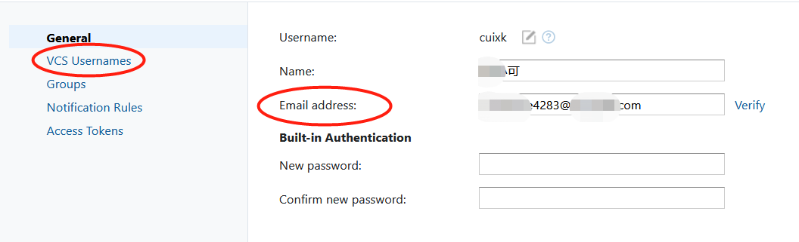
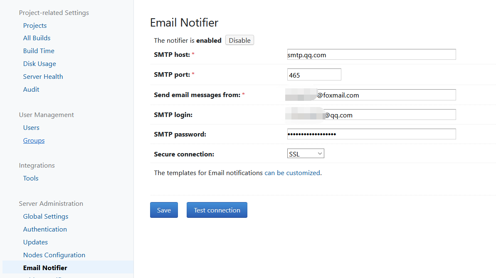
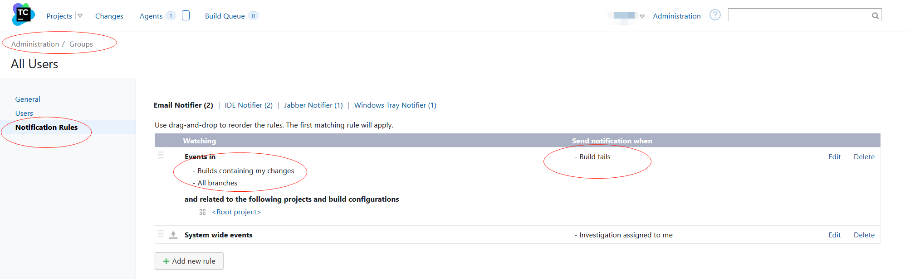

# 开始

## 介绍

* 用于持续化集成, 持续化部署.

* Server是管理中心, Agent是真正提供CI/CD功能的组件.

## 安装

```bash
curl -LO https://download.jetbrains.8686c.com/teamcity/TeamCity-2020.1.3.tar.gz
tar -zxvf TeamCity-2020.1.3.tar.gz
```

## 配置

### Server

* **数据目录**: 存放Configuration配置, 构建结果, 当前操作文件. 

  默认`%USERPROFILE%.BuildServer`目录下. 可修改, 修改`bin/startup.sh`文件, 添加

  ```properties
  export TEAMCITY_DATA_PATH=/data/teamcity-frontend-data
  ```

  > 修改配置文件`teamcity-startup.properties`的方式, 貌似不生效.

* **数据库**: 存放构建历史, 用户信息和其他数据. 

  > 数据库的连接配置将存入数据目录中

* **服务端口**, 默认`8111`, 可修改`conf/server.xml`文件

### Agent

* 配置文件`buildAgent/conf/buildAgent.properties`

* 配置Server地址

  ```
  serverUrl=http://localhost:8111/
  ```

## 操作

* 启动server和agent

  ```bash
  runAll.sh start
  ```

* 关闭server和agent

  ```
  runAll.sh stop
  ```

# 邮件通知

邮件通知, 需满足几个条件:

1. 用户个人信息需含有**邮件地址**和**VCS Usernames**

   

   VCS Username是提交记录时用的名字, 通过如下方式可查到:

   ```shell
   $ git config -l
   ...
   user.email=sidian123@qq.com
   ```

   这里的`sidian123`就是VSC名字.

2. 配置邮件服务器

   

3. 配置通知规则

   

   以管理员身份, 配置的通知规则作用域一个组的所有用户. 默认规则是, 当**代码提交**后, 项目部署失败, 会邮件通知导致部署失败的用户. 但手动Run, 是不会有邮件通知的.

-----------

**原理:** Teamcity能拿到提交记录的邮箱`user.email`, 取`@`前的名字, 与VCS Names比对, 找到对用用户. 再向用户填写的邮箱上发送通知. 

> 具体功能由VCS root提供, 其配置Username style制定匹配规则

> 参考
>
> * [What is the correct VCS Username settings with Github so that “My Changes” works correctly?](https://stackoverflow.com/questions/9295649/what-is-the-correct-vcs-username-settings-with-github-so-that-my-changes-works)
> * [Subscribing to Notifications](https://www.jetbrains.com/help/teamcity/2019.2/subscribing-to-notifications.html)
> * [Configuring VCS Roots](https://www.jetbrains.com/help/teamcity/2019.2/configuring-vcs-roots.html)


