* 书的组织结构
  * 第一章: 编译器纵览
  * 第2-4章: 前端算法
  * 第5-7章: 中间代码生成
  * 第8-10章: 代码优化
  * 第11-13章: 聚焦后端算法

# 一 概览

## 介绍

* 编译器是一个将某种语言编写的程序翻译成另一种语言编写的软件, 并且转化前后的两种语言语义不变.

  > 如将某种高级语言编写的代码转化未机器指令

  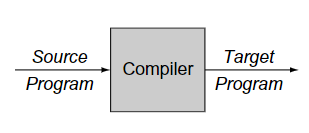

* 程序语言与自然语言
  
  * 程序语言形式比较固定, 有更丰富的表达力, 更简洁, 更清晰; 而自然语言允许存在**模糊性**

* 编译器与解析器

  * 编译器是为了将一种语言翻译成另一种语言, 而解析器是将一种语言的程序执行, 得到程序的结果.

    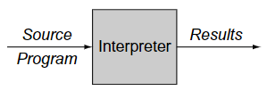

    > 如
    >
    > * C++使用**编译器**编译后才能执行 
    >
    > * JavaScript使用**解析器**执行运行
    > * Java使用**编译器**编译成字节码, 然后用JVM**解析**执行.
    > * 或者JVM这个解析器中嵌入编译器, 将执行频率高的代码编译成机器码来执行, 其他的就解析, 这个方式称为**JIT**(just-in-time compiler)
  
  * 两者前期的任务都差不多

## 编译器结构

* 结构

  - frond end前端: 处理源代码
  - back end后端: 处理目标代码
  - intermediate  representation(IR): 独立于源和目标代码的中间形式, 也就是中间代码
  - optimizer优化器: 分析和优化中间代码 

  > 中间代码达到了前后端关注点分离的目的

* 编译器经典三层模型

  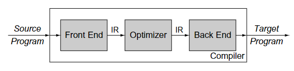

  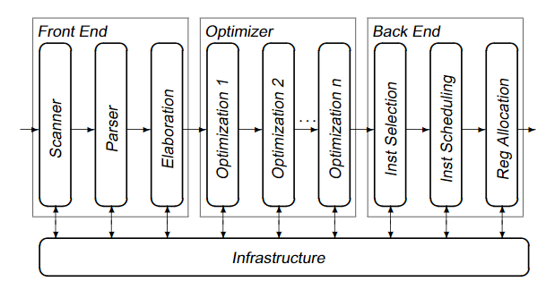

## 翻译过程

* 前端: 先了解当前语言的语法`syntax`和语义`semantics`

	* 词法分析Scanning: 根据词性归类
	* 语法分析Parsing: 判断是否符合语法
	* 语义分析: 是否符合语义, 即是否定义了变量, 是否类型一致等
	* 中间代码生成
* 优化
  * 分析: 推断出IR运行时的表现, 判断编译器是否可以安全的, 有效的使用某种优化方案
  * 变换transormation: 依赖上一步的结果, 重写代码以达到某种优化目的, 如减少体积, 提升速度等.

* 后端
  * Intruction Selection: 中间代码IR的每个指令如何映射到目标指令上, 仅对IR做了一对一的替换, 使用了虚拟寄存器, 假设资源充足.
  * Register Allocation: 实际不可能无限提供寄存器, 因此存在一个虚拟寄存器到真实寄存器的映射过程
  * Instruction Scheduling: 重新规划指令的执行循序, 什么时候执行什么指令, 并不影响正常结果却能提高执行效率, 这需要配合处理器中**指令的并行执行**的特性的使用.
  * 目标代码生成

> 前端比较容易, 时间复杂度低, 耗时少; 优化和后端才是最难的部分, 影响编译时间的主要因素.

# 二 词法分析(Scanner)

## 介绍

* 任务

  * aggregation: 将**字符串**流转化为源语言的**单词(Word)流**. 

    > 单词才具有丁点语义

  * classification: 为每个单词归类(syntactic category)

    > 可类比语言中的词性

* 分类
  * generated  scanners: 生成的分析器, 如使用语言自带的正则, 比较方便.
  * hand-crafted scanner: 完全自己实现的, 拥有更高的效率

* microsyntax
  * 分析词法结构的规则
  * 每一条规则规定一类单词
  
* 效率

  * 词法分析器的时间成本与输入字符串的长度成正比
  * 越复杂的词法, 其内部状态越多, 则空间需要越多

## 状态转换图(Transition Diagram)

*  transition diagram: 以状态机描述的**词法分析器**或**规则**

  * 每个状态由圆圈标识

  * 开始状态标注`s0`, 结束状态以同心圆表示

  * 箭头符号表示, 输入什么字符(edge label), 该状态对应的规则将决定其跳转(transition)到什么状态

  * 每个状态都有一个错误状态的跳转, 但默认在图中不给出.

    > 即输入字符, 不知道下一跳转.

  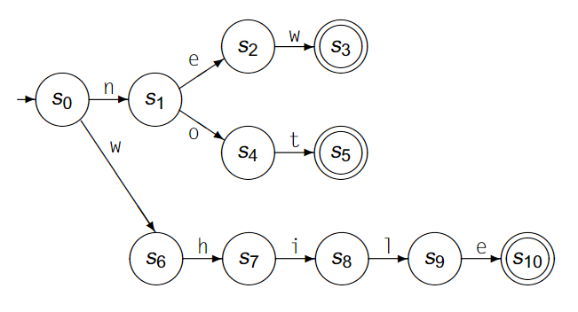

  > 分析`new`, `not`和`while`的词法分析器

* 更复杂的情况(有回路):

  * 下一状态指向自身

  * 状态一个跳转的输入条件可以很复杂, 如一个范围

    > 或一种语言, 在正则中很容易表示, 如`\w+`表示由字母组成的语言, 见2.4小节

  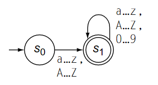

  > 一个复杂的, 关于标识符的分析器

## 有限自动机(Finite Automaton)

* 词法分析器的形式化表示, 比状态图更加的严谨和具体

* FA可由五元组表示: 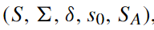

  

  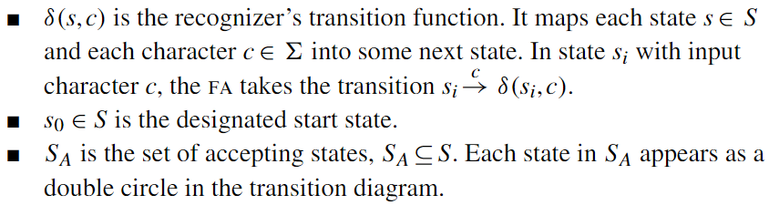

* 例子, 上述状态机可表示为

  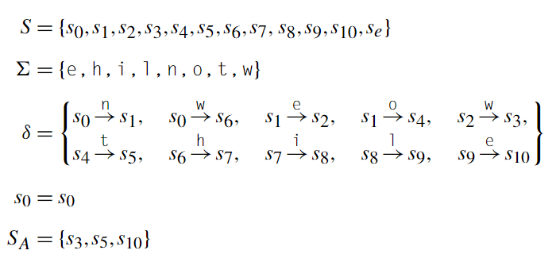

  > 还有一条默认的规则, 即除了`δ`的规则外, 其他的组合都跳转到错误状态:
  >
  >  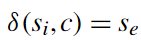
  >
  > > 隐藏的含义: 一旦进入错误状态, 接下来无论任何输入, 都保持在错误状态.

* 最终结果

  * 成功识别

    * FA能够识别一个字符串, 当且仅当到达了结束状态(Accepting State), 且扫描完了输入字符串

    * 一个更为公式化的例子

      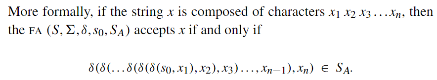

  * 到达了错误状态
  
  * 输入结束未到达结束状态(Accepting State)和错误状态

* FA识别的单词的集合形成了一个语言.

  > 如果`F`是一个有限自动机, 则`L(F)`表示该自动机形成的语言

## 正则表达式(Regular Expression)

* 一个FA定义了一种语言, FA也可以通过正则(RE)来描述, 给定一个正则`r`, 那它定义的语言可表示为`L(r)`

* 正则的基本操作

  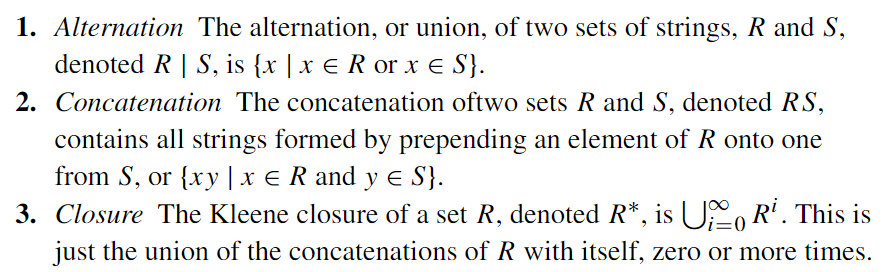

  > 即集合之间的操作, 集合也可称为语言, 由正则轻易表示出, 如上述的字符串集合R, S可以是`\w+`, `\d+`等等 
  >
  > 大写字母表示集合, 小写表示具体的某个字符串

  >还有其他的操作都有由这三种操作派生, 如
  >
  >- finite closure: R^i^表示重复R i 次. 如, R^3^, 可表示为(R|RR|RRR)
  >- positive closure: R^+^表示重复1到多次, 可表示为RR^*^
  >- complement: `^x`等于`x`相对于有限字符集`∑`的补集.

* 上述的操作是通过集合来演示的, 这里给出正则的形式:

  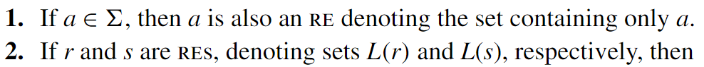

  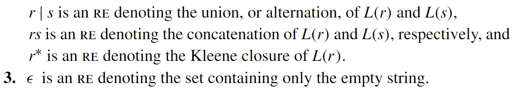

  > 其实和上面的集合操作没啥区别, 只是将集合换成了正则, 规则复述一遍

* 优先级: `()` > Closure > Concatenation > Alternation

## RE to FA

### 介绍

* 构建过程

  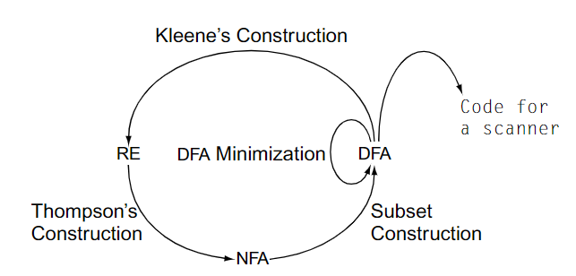

  > `D`表示`deterministic`; `N`表示`nondeterministic`

  * 构建思路
    * RE适合建模, DFA适合转化为代码, RE容易转化为NFA
    * 因此构建过程: RE->NFA->DFA->优化后的DFA

* **确定有限自动机NFA**: 允许`∈`作为输入, 导致一个状态对于同一个输入, 会出现多个输出.
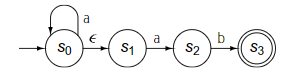
  
  > 如`s0`对于输入`a`, 可以过渡到`s0`或`s2`状态.
	
  * 两种运作模型
    * 先知模型: NFA碰到非确定状态时, 能够知道下一个状态是什么, 最终解析字符串. 实际上, 是靠猜的.
    * 遍历模型: NFA碰到一个确定状态时, 都需要遍历所有非确定状态构成的路径, 才能最终解析字符串
  * 无论哪种模型, NFA能够识别字符串, 当且仅当状态图中至少存在一条路径, 接受所有的字符.
  
* **非确定有限自动机DFA**: 不允许`∈`的作为输入, 一个状态对于同一字符只有一种输出. 

* NFA与DFA
  * NFA与DFA在语言表达能力上, 是一致的
  * DFA是NFA的一种特殊情况
  * 任何NFA都可转化为DFA. 在遍历模型中, 不确定的状态可通过枚举 ,确定其最终路径. 因此, DFA可以通过提供更多的状态, 记录所有路径信息, 最终将NFA转化为DFA.
  * NFA转化为DFA, 只会造成更多的空间消耗, 而无时间消耗. 

### RE to NFA

> Thompson’s Construction 算法

* 思路: 该算法提供了以下简单的替换模板

  * RE的每个字符可转化为NFA

    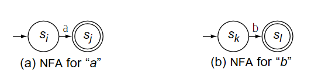

  * RE的基础操作

    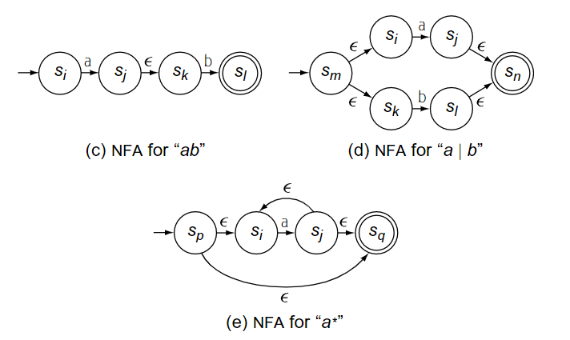

  * 根据这三种基本操作的优先级组合, 可将任何RE转化为NFA

* 例子: a(b|c)^*^转化为NFA

  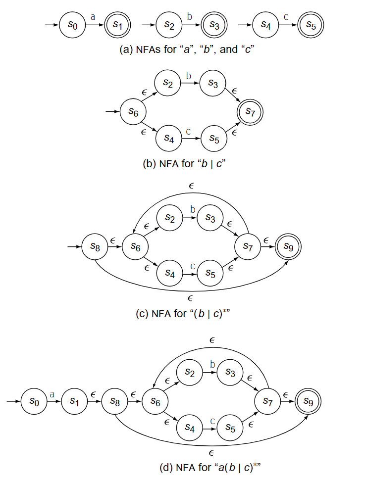

  > 注意转化时, 基本操作的优先级.
  >
  > 建议先构建表达式树, 并进行后序遍历
  >
  > 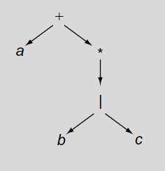

* 该算法的特性

  * 每个NFA都有且只有一个开始和结束状态.
  * 每个状态最多有两个前继分支和后继分支

### NFA to DFA

> Subset Construction  算法

* 思路: 去掉`∈` , 具体见例子

* 算法
    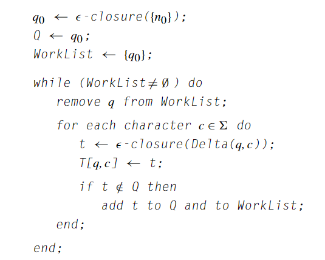
    
    > * `∈-closure({n0})`对集合`{n0}`中的所有状态输入0到多个`∈`, 得到的所有状态的集合.
    > * `Delta(q,c)`对集合`q`中所有的状态输入字符`c`, 得到下一状态集合
>
    > > 看到这幅图就想打死作者, 到处是模糊的语义,

* 例子
    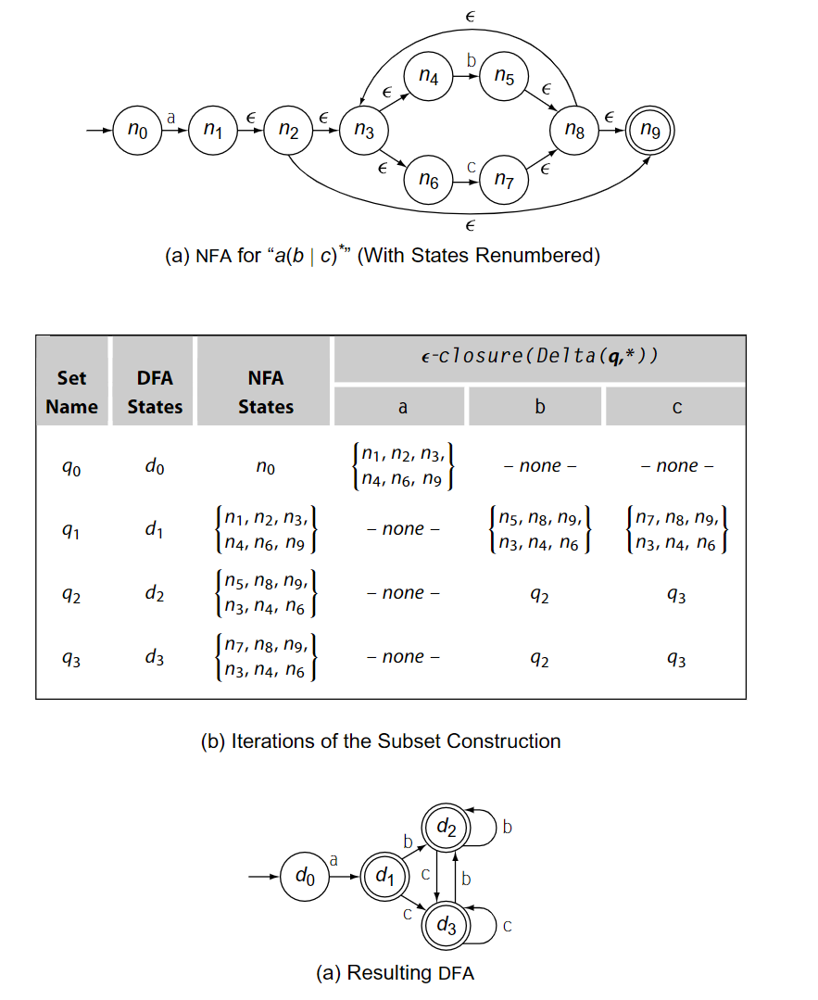
    
     下面是写代码时所记录的, 请忽略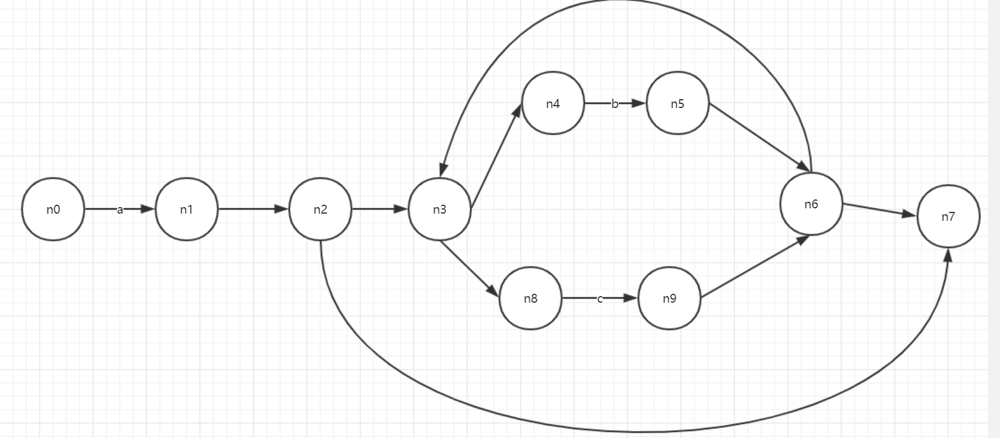
    
    |                       | a                   | b                     | c                   |
    | --------------------- | ------------------- | --------------------- | ------------------- |
    | {n0}                  | {n1,n2,n3,n4,n7,n8} | {}                    | {}                  |
    | {n1,n2,n3,n4,n7,n8}   | {}                  | {n5 n6 n7 n3 n4  n8 } | {n9 n6 n7 n3 n4 n8} |
    | {n5 n6 n7 n3 n4  n8 } | {}                  |                       |                     |
    | {n9 n6 n7 n3 n4 n8}   | {}                  |                       |                     |

### DFA to Mini DFA

> Hopcroft's Algorithm

* 目的: 将状态分区 P={p~1~,p~2~,p~3~,...p~m~} 
* 思路

